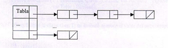

# Manual Técnico

## Indice

- [Introducción](#introducción)
- [Objetivos](#objetivos)
- [Alcances del proyecto](#alcances-del-proyecto)
- [Requerimentos funcionales](#requerimentos-funcionales)
- [Atributos del sistema](#atributos-del-sistema)
- [Estructura de bases de datos](#estructura-de-bases-de-datos)
- [Estructura de tablas](#estructura-de-tablas)
- [Reportador gráfico](#reportador-grafico)
- [Diagrama de clases](#diagrama-de-clases)
- [Diagrama de Gantt](#diagrama-de-gantt)

## Introducción
Este proyecto ofrece una estructura para un gestor de bases de datos, se encuentran dos tipos de estructuras, listas propias de Python para manejar las bases de datos y tablas, y tablas hash para los registros de las tablas (Tuplas). El código presentado contiene una librería propia para que sea fácil de utilizar desde fuera. Cada estructura utilizada fue seleccionada bajo criterios de eficiencia. 

## Objetivos

### General

Proporcionar una estructura de datos completa y eficiente para obtener el mejor manejo y resguardo de datos que se desee. Así como cumplir con los estándares necesarios de un manejador de base de datos.

### Específicos

- Ser capaz de alojar N bases de datos con M tablas y X registros sin importar la longitud de cada uno.
- Evitar perdida de datos, tanto en registros como tablas o bases de datos enteras.
- Contemplar cualquier tipo de error ya sea en escritura de nombres o ingreso de datos para evitar errores innecesarios.
- Informar errores por medio de valores de retorno de cada función a la cual se acceda.


## Alcances del proyecto

Este proyecto esta focalizado a la creación de la estructura interna de un Sistema Manejador de Bases de Datos, o DataBase Management System (DBMS). Se podría calificar como un subproyecto, de un proyecto que se trabaja en conjunto a compañeros de otros dos cursos de la carrera de Ingenieria en Ciencias y Sistemas en la Universidad de San Carlos de Guatemala, siendo la idea primordial, la unificación de los 3 proyectos, para la creación de un DBMS completo y funcional, creado desde cero, y con licencia abierta MIT.

Esta siendo elaborado por estudiantes del curso Estructuras de Datos, por lo cual consiste en una librería que provee funciones para crear, modificar y eliminar bases de datos, tablas y sus registros.  

El modo de almacenamiento que maneja esta librería es por medio de tablas Hash, de ahí el nombre HashMode, la estructura propuesta se utiliza en las tablas, es decir cada tabla se maneja como una Tabla Hash en la cual se almacenan los registros o tuplas, el acceso al almacenamiento es por medio de la llave primaria previamente definida para la tabla en cuestión, o bien, con una llave escondida en caso que no se defina llave primaria.

La finalidad de utilizar las tablas Hash como modo de almacenamiento es para explotar su orden de complejidad, en la búsqueda de los datos, siendo esta en el mejor de los casos un orden constante O(1), puesto que con la función hash se puede obtener directamente el índice en el cual se encuentra almacenado el dato al que queremos acceder. 

Se utiliza una Tabla Hash abierta de direccionamiento cerrado, se eligió esta, sobre la tabla cerrada de direccionamiento abierto, pues se exploro una forma de explotar la característica de enlistar los datos que van al mismo índice (conocidos como colisiones), pues esta lista es manipulable y se pueden explorar algoritmos de búsqueda mas rápidos, situación que se vuelve complicada en las tablas de direccionamiento abierto, pues en ellas no se conoce con exactitud donde pueden ubicarse los datos que colisionan, creando una complejidad lineal O(n) en el acceso a los datos, sin embargo las cuestiones técnicas de la elección de la estructura se abordan en la sección [Estructura de tablas](#estructura-de-tablas).

No todo se maneja con tablas Hash, puesto que se considero que la parte con mas volumen de datos a manejar son las tablas, sin embargo, las bases de datos se manejan como listas sencillas de Python, pues no se esperan cantidades excesivas de tablas en una base de datos, así mismo la lista que almacena las bases de datos es una lista sencilla de Python. 

Como estructura interna de un DBMS, además de la eficiencia y eficacia de las creaciones, inserciones y demás gestiones, otro punto importante es la persistencia de los datos, dicha persistencia se maneja con un sistema hibrido entre un sistema jerárquico de ficheros y la serialización de objetos que guardan la información de cada Tabla Hash, así cada vez que se insertan nuevos registros los cambios se guardan en memoria volviendo a serializar los objetos previamente creados, este proceso de recuperar y serializar los objetos puede ser significativo para la maquina y la eficiencia del proyecto, es por ello que se recurrió a algoritmos que hicieran menos recurrente este proceso y se aprovecharan también los recursos cargados en memoria en cierto instante de la ejecución de la librería, esto hace más eficaz las operaciones aunque exige un poco de persistencia en memoria de cierto objetos, siempre respetando limites para no sobrecargarla de información.

## Requerimentos funcionales

- Los nombres de base de datos deben respetar las reglas de nombrado.
- Los nombres de tablas deben respetar las reglas de nombrado.
- Se deben enviar los argumentos que se solicitan para evitar errores.
- Para crear una base de datos debe enviar un nombre, el cual no debe existir ya almacenado.
- Para crear una tabla debe enviar el nombre de la base de datos, nombre de la tabla y número de columnas, dicho nombre no debe existir ya almacenado.
- La interfaz gráfica es un componente que aprovecha la librería, para su uso se deberá llamar de forma independiente a HashMode.
- Cualquier acción que quiera realizar se hará por medio de *Hash Mode*, donde tendrá una mejor orientación para enviar los datos.
- Debe tener [graphviz](https://graphviz.org/download/) para poder observar la estructura de cada almacenamiento de forma grafica por medio de la interfaz gráfica.

## Atributos del sistema

- Las estructuras proveerán un alojamiento seguro y eficiente.
- Brindará una librería propia para que sea más fácil de implementar.
- Las funciones existentes retornaran valores numéricos para informar el estado de la operación.
- Las funciones existentes retornaran Listas para informar el estado de la operación.
- Las estructuras serán capaces de evitar la duplicidad de datos.
- Brindará una interfaz gráfica para visualizar el funcionamiento interno de las estructuras.
- Serealizará los objetos creados para evitar perdidas de datos.
- La librería implementa métodos de serealización que ayuda a la eficiencia y fluidez del sistema. 

## Paradigma utilizado

Todas las estructuras hace un uso amplio del paradigma orientado a objetos. Una instancia de la [estructura de bases de datos](#estructura-de-bases-de-datos) contiene varias [estructuras de tablas](#estructura-de-tablas), y estas a su vez contienen varias [estructuras de registros](#estructura-de-registros), siendo cada uno de los intermediarios un objeto, que a su vez es una estructura. La última estructura también contiene objetos Nodo, los cuales contienen atributos especiales, de llave primaria y la contención de los datos, siendo básicamente cada nodo la tupla o registro de la tabla. Lo anterior descrito puede ser observado en el [diagrama de clases](#diagrama-de-clases).

## Estructura de bases de datos

### Estructura utilizada

Para el almacenamiento de las bases de datos se optó por usar una lista de Python que almacena estructuras Bases de Datos.

#### ¿Por qué una lista de Python?

Una lista de python fue elegida dada su naturaleza dinámica y eficaz, sin contar los métodos inherentes de la lista de Python. La estructura manejada no ordena las bases de datos, si no que gestiona los datos tal como una cola, es decir que la primera base de datos en entrar a la lista será la primera a la que se acceda (FIFO).


Existe una relación directa entre cada objeto BaseDatos que almacena la lista y el contenido de la carpeta *data/hash*, a una base de datos *database* en la lista de bases de datos le corresponde una carpeta *data/hash/**database***. 

> **Nota:** Aunque las bases de datos se almacenen en disco mediante un modelo jerárquico, todas las bases de datos se mantienen en memoria para trabajar diréctamente sobre estas (más no las [Tablas](#Estructura-de-tablas)).

### Clases y sus atributos
La lista de bases de datos se trata de un atributo de la clase ListaBaseDatos, donde cada elemento de la lista se trata de un objeto de la clase BaseDatos, esto se puede observar de mejor manera en el [diagrama de clases](#diagrama-de-clases).

#### Nodo

Los nodos de la lista (BaseDatos) se explican de manera amplia en la sección [Estructura de tablas](#Estructura-de-tablas).

#### Lista de bases de datos

La librería hace uso de una instancia de la clase ListaBaseDatos, que no requiere argumentos. Los métodos de esta clase hacen uso de los métodos de las listas de Python, con las respectivas validaciones.

Para crear una base de datos, se añade una instancia de la clase BaseDatos mediante el método *append()* de las listas, para eliminar una base de datos se hace uso del método *remove()* de las listas, y para modificar el nombre de una base de datos, se busca en la lista y se cambia su atributo *nombre*.

### Información sobre funciones de la clase ListaBaseDatos.py


## Estructura de tablas

### Estructura utilizada

Para el almacenamiento de las tablas se optó por usar una lista de Python que almacena estructuras de Tablas.

#### ¿Por qué una lista de Python?

Debido a su naturaleza dinámica y eficaz, sin contar los métodos inherentes de la lista de Python. La estructura manejada no ordena las tablas, se almacenan como colas (FIFO).


Existe una relación directa entre cada objeto Tabla que almacena la lista y el contenido de la carpeta *data/hash/database*, a cada tabla *table* en la lista de tablas le corresponde una carpeta *data/hash/database/**table**. 

> **Nota:** Las tablas se serealizan para evitar perdida de datos como los registros *tuplas*, sin embargo por motivos de eficiencia se han mejorado metodos de serealización para tener una respuesta en menor tiempo.

### Clases y sus atributos

La lista de tablas se trata de un atributo de la clase BaseDatos, donde cada elemento es creado y gestionado en dicha clase, comparte información con la clase Tabla, esto se puede observar de mejor manera en el [diagrama de clases](#diagrama-de-clases).

#### Nodo

Los nodos de la lista (Tabla) se explican de manera amplia en la sección [Estructura de registros](#estructura-de-registros).

#### Lista de tablas

La librería hace uso de una instancia de la clase BaseDatos, debe siempre enviar el nombre de la tabla y el directorio padre (de la base de datos a la cual pertenece) para no cometer errores en la manipulación de las mismas. Los métodos de esta clase hacen uso de los métodos de las listas de Python, con las respectivas validaciones.

Para crear una tabla, se  validar que exista la base de datos especificada y que no exista la tabla que desean crear, si pasa las validaciones se añade una instancia de la clase Tabla mediante el método *append()* de las listas, para eliminar una tabla se hace uso del método *pop()* de las listas, y para modificar el nombre de una tabla se busca en la lista por medio del *index()* de las listas, se cambia su atributo *Name*.

### Información sobre funciones de la clase BaseDatos.py


## Estructura de registros
 
### Estructura utilizada

 La estructura utilizada para el almacenamiento de las tuplas es una tabla Hash abierta de direccionamiento cerrado, con los siguientes atributos:
-	 Su tamaño inicial es 13
-	Con un máximo de 90% y un mínimo de 30%
-	La función hash implementada, método de división (k mod m)

#### ¿Por qué una tabla hash abierta de direccionamiento cerrado?

Se opto por este tipo de tabla hash para optimizar las búsquedas al momento de las colisiones, pues en una tabla hash cerrada de direccionamiento abierto las colisiones son mas frecuentes e incontrolables, pues estas se manejan aumentando el índice y nunca se puede llevar un control de donde realmente las va a colocar, puede llegar a un punto donde siempre colisione haciendo que los índices se corran y la búsqueda resultar lineal.


Al observar esto, y contemplar la posibilidad de que el orden se vuelva lineal, se concluyo que esto no seria optimo. Por lo cual se exploro las tablas hash abiertas de direccionamiento cerrado, en estas se debe ir formando una lista de los valores que colisionen, asi que se sabra con certeza donde están los valores, sin embargo, el problema persistiría la búsqueda se volvería lineal.

Aquí es donde se hizo la modificación para la optimización de búsquedas, se ordena la lista para implementar una búsqueda binaria interna, asegurando así que el orden no llegaría a ser lineal, si no, *logarítmico*.



El algoritmo es sencillo, en cada inserción se comprueba si la lista esta vacía, si lo esta el dato sencillamente se inserta, si no lo esta el dato se inserta y posteriormente la lista se manda a un método burbuja para ser ordenada.

Se sacrifica tiempo en la inserción, pues esta aplica ordenamientos y mas comprobaciones, pero este tiempo se optimiza al momento de cualquier búsqueda, para eliminar, modificar o sencillamente consultar.

>**Nota:** Esta optimización solo se logro para llaves primarias enteras, las llaves primarias string causan confusión, en caso de tener llaves string el orden si podría llegar al ser lineal 

### Clases y sus atributos

Para el correcto funcionamiento de las tablas se hizo uso de dos clases, Tabla y Nodo, cada tabla en la libreria es una instancia de Tabla y cada registro o tupla es una instancia de la clase Nodo, esto se puede observar de mejor manera en el [diagrama de clases](#diagrama-de-clases).

#### Nodo

Como se mencionó anteriormente, una instancia de esta clase representa una tupla o registro de la tabla, para instanciar esta clase se requieren los siguientes argumentos:
- Los datos a registrar
- Una lista con las posiciones de la llave primaria
- Un contador, en caso se maneje llave oculta

Estos argumentos se pasan automaticamente en el metodo *insertar* de la clase Tabla, los datos son los datos que se quieren regsitrar, la lista es el atributo PK de la clase, y el contador es un autoincrementable que maneja la clase.

Este objeto sirve como un contenedor, en este se contienen los datos del registro, y el mismo objeto al instanciarse verifica las posiciones de la llave primaria (la lista que se le envia) y automáticamente la forma, en caso la Tabla no tenga llave primaria definida, el atributo PK sera *None*, y en dicho caso el objeto toma como llave primaria el contador que recibió. 

> **Nota:** Así es como cada instancia de Nodo es un registro o tupla con su llave primaria definida.

#### Tabla

Cada instancia de Tabla, es una tabla en la base de datos, la cual maneja el almacenamiento por medio de una Tabla Hash, para instanciar esta clase se requieren los siguientes argumentos:
- Nombre, el nombre de la tabla, el cual sera unico en determinada Base de Datos
- Columnas, es el número de columnas que posee la tabla

Con estos parámetros se construye el objeto, el cual toma el nombre indicado y se atribuye el numero de columnas igualmente indicado, define su tamaño inicial como 13, la Pk y tipo de Pk, como *None* pues esto debe ser indicado posteriormente por otro metodo, y sus respectivos contadores de datos y factor de carga como 0.

> **Nota:** Una vez instanciado este objeto se puede decir que la base de datos tiene una tabla mas, en la cual se pueden realizar inserciones y demas operaciones.

## Reportador grafico

En la creacion del reporte grafico se inclino en la creacion de una interfaz interactiva con el usuario para gestionar todo el funcionamiento del programa. Para ello se declino a la utilizacion de la libreia Tkinter la cual proporciono un conjunto de herramientas para la administracion de ventanas.
```sh
import Tkinter
```
Tkinter es un conjunto de funciones que envuelven las implementaciones widgets Tk como clases de Python y tiene ventajas como su velocidad que generalmente se suministra de forma nativa con Python. 

#### Widgets
Utilizando los widgets Tk y Toplevel donde se proporciona un lienzo (ventanas) y con un conjunto adicional de widgets se utilizaron para darle un excelente diseño en diferentes areas de las ventanas, algunos de estos fueron.
```sh
Frame: Espacio donde se almacenan un definido conjunto de widgets.
Button: Creacion de botones.
Label: Espacios de textos definidos.
PhotoImage: Proyeccion de imagenes buscadas en un directorio actual.
Entry: Entradas de texto por parte del usuario
```
#### Clases y atributos 
###### Window Databases
Ventana que administra todas las gestiones de las bases de datos, utilizando todos los recursos disponibles que ofrece la libreria se logro un diseño sencillo y funcional.
###### Window Tables
Ventana que permite gestionar todas las funcionalidades sobre las tablas que puede almacenar una base de datos, su funcionalidad proviene de la clase window databases quien acomoda las gestiones de las tablas dependiendo de la base seleccionada previamente.
###### Window Tuples
Ventana al igual que las otras permite el gestionamiento de los registros almacenados en una tabla, con uso de metodos propios en el sistema se logra adaptar la clase dependiendo de la base de datos y tabla previamente seleccionadas, ademas dando una visualizacion de la estructura utilizada.

## Diagrama de clases


## Diagrama de Gantt


