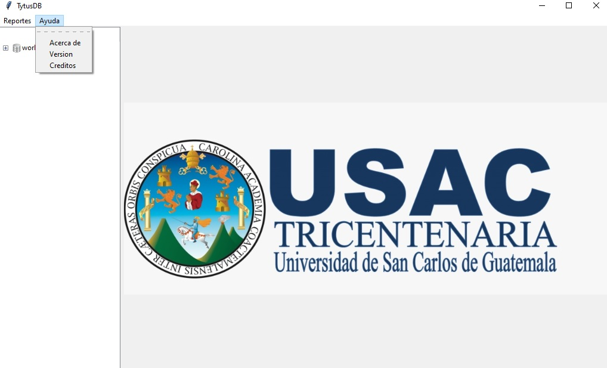

	x# MANUAL DE USUARIO

UNIVERSIDAD DE SAN CARLOS DE GUATEMALA  
FACULTAD DE INGENIERÍA  
ESCUELA DE CIENCIAS Y SISTEMAS  
CURSO: ESTRUCTURA DE DATOS
___

  

## GRUPO 01 
* 9213640		Edwin Mauricio Mazariegos 
* 200915715		Edgar Enrique Patzan Yoc 
* 201213010		Gabriel Orlando Ajsivinac Xicay 
* 201213212		Walter Manolo Martinez Mateo 
* 201313996 	Karen Elisa López Pinto
___
# ÍNDICE
- [DESCRIPCIÓN DEL SISTEMA](#DESCRIPCIÓN-DEL-SISTEMA)
	- [Objetivo](#Objetivo)
	- [Alcance](#Alcance)
	- [Funcinalidad](#Funcionalidad)
- [VISUALIZACION DEL SISTEMA](#VISUALIZACIÓN-DEL-SISTEMA)
	- [Ventana Principal](#Ventana-Principal)
	- [Visualización del Menú de  Reportes](#Menú-de-Reportes)
	- [Visualización del Menú Ayuda](#Menú-ayuda)
- [GLOSARIO](#GLOSARIO)
- [REFERENCIAS](#REFERENCIAS)
___
# DESCRIPCIÓN DEL SISTEMA

## Objetivo
- El propósito de este documento es dar a conocer a los ususarios finales las características y las formas de funcinamiento de una base de datos llamado TytusDB, utilizando el modo de almacenamiento AVL, proporcionando al servidor un conjunto de funciones para extraer la información, esto realizado como proyecto del curso de "Estructura de Datos".
- Proporcionar al usuario la informacion necesaria para crear una BD por medio de un AVL como método de almacenamiento.
## Alcance
- Informar al usuario de futuras generaciones como implementar un método de almacenamiento teniendo como base la implementación de un AVL.
- Tener un proceso continuo de revisión y actualización.
- Facilitar a través del diseño, su uso, conversación y actualización.
## Funcionalidad
El sistema está elaborado en el lenguaje de programación Python, donde por medio de la implementación de un AVL se realizó el almacenamiento para la creación de una BD que por medio de funciones se extrae la información.
El usuario podrá cargar archivos el cual podrá medir el alcance del software.
Se podrá observar la generación de reportes.
___

# VISUALIZACIÓN DEL SISTEMA

## Ventana Principal

  

## Menú de Reportes

  

   | **SubMenú**                         | **Función** |
   | ----------------------            	 | ------------------------ |
   | Reportes                            | Esta función nos permite seleccionar los datos que deseamos graficar por medio del método AVL. |
   | Bases de Datos	                 | Se mostrará en pantalla un árbol AVL con todas las bases de datos ingresadas previamente seleccionadas para graficar. |
   | Tablas	 	                 | Se mostrará en pantalla un árbol AVL con todas las tablas ingresadas en las bases de datos ingresadas previamente seleccionadas para graficar. |
   | Registros		                 | Se mostrará en pantalla un árbol AVL con todos los registros ingresados en las tablas que se ingresaron en cada una de las bases de datos ingresadas previamente seleccionadas para graficar. |
 
	
## Menú ayuda

  

   | **SubMenú**                         | **Función** |
   | ----------------------            	 | ------------------------ |
   | Acerca De                           | Se muestra en pantalla la información del programa. |
   | Versión	    	                 | Se muestra en pantalla la información del estado en que se encuentra el programa. |
   | Creditos	 	                 | Se muestra en pantalla la información de las personas que ayudaron en la creación del programa. |
   
# GLOSARIO

	- AVL : Árbol binario de busqueda auto-balanceable.
	- BD : Conjunto de datos pertenecientes a un mismo contexto.
___

# REFERENCIAS
- Arbol AVL https://estructurasite.wordpress.com/arbol-avl/
- Algoritmos de un AVL https://runestone.academy/runestone/static/pythoned/Trees/ImplementacionDeUnArbolAVL.html
- Tkinter -Python interface https://docs.python.org/3/library/tkinter.html
