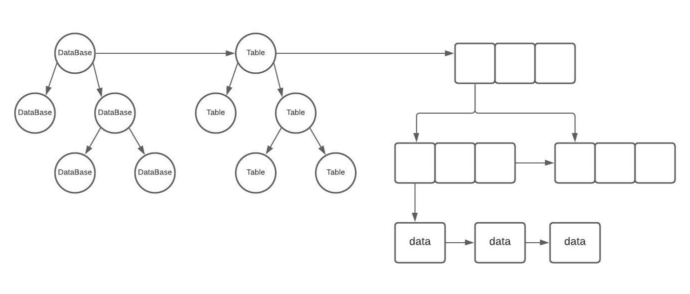

## Grupo 3
### Integrantes
* 201504443 Virginia Sarai Gutierrez Depaz
* 201504464 Herberth Abisai Avila Ruiz
* 201531166 Maynor Octavio Piló Tuy
* 201602489 Josué Alfredo González Caal
#

# Manual Técnico Tytus DB
En el presente documento se muestra las técnicas que fueron aplicadas durante la
ejecución del proyecto, con el fin de visibilizar la información y sistematizar los procesos de
extracción de información del administrador de Bases de datos. Detallando los elementos técnicos para la implementación de B+Mode.

**¡RECOMENDACION!** : Tener en cuenta que el fin de este manual es documentar las
técnicas usadas durante el proyecto, y no como un curso de aprendizaje.

## Objetivo
#
Proporcionar una solución de estructuras de datos para gestionar la información de un sistema de bases de datos.

## Descripción General del fujo del Sistema
#

El administrador de bases de datos es el componente encargado de gestionar el almacenamiento de las bases de datos, proporcionando al servidor un conjunto de funciones para extraer la información.

Donde cada registro que corresponde a una tupla de una tabla será almacenado en cada nodo de un arbol B+, cada tabla que corresponde a un abol B+ será almacenado en un nodo de un arbol AVL siendo este una base datos donde tendremos un conjunto estructuras arboreas.

<p align="center">
  
</p>

## Fundamentos Teóricos
#

Es un proyecto Open Source desarrollado para crear un administrador de bases de datos utilizando distintos modos de almacenamiento mediante el uso distintas estructuras de datos.

**Open Source** es el software que respeta la libertad de los usuarios y la comunidad. A
grandes rasgos, significa que los usuarios tienen la libertad de ejecutar, copiar, distribuir,
estudiar, modificar y mejorar el software. 

Un programa es Open Source si los usuarios tienen las cuatro libertades esenciales:
- La libertad de ejecutar el programa como se desea, con cualquier propósito
(libertad 0).
- La libertad de estudiar cómo funciona el programa, y cambiarlo para que haga lo
que usted quiera (libertad 1). El acceso al código fuente es una condición
necesaria para ello.
- La libertad de redistribuir copias para ayudar a su prójimo (libertad 2).
- La libertad de distribuir copias de sus versiones modificadas a terceros (libertad 3).
Esto le permite ofrecer a toda la comunidad la oportunidad de beneficiarse de las
modificaciones. El acceso al código fuente es una condición necesaria para ello.

La licencia utilizada en este proyecto es la licencia MIT:

- Licencia MIT: Es una licencia muy permisiva que admite el uso comercial, la
redistribución, la modificación, etc. La única condición es que proporcionemos una
copia de la licencia con el software que hemos distribuido.

**Arbol B+**
Son variante de los árboles B que permite realizar de forma eficiente tanto el acceso directo mediante clave como el procesamiento en secuencia ordenada de los registros, es la estructura de árbol B+. Los árboles B+ almacenan los registros de datos sólo en sus nodos hoja (agrupados en páginas), y en los nodos interiores y nodo raíz se construye un índice multinivel mediante un árbol B, para esos bloques de datos.
Los árboles-B+ se han convertido en la técnica más utilizada para la organización de archivos indizados. La principal característica de estos arboles es que todas las claves se encuentran en las hojas y por lo tanto cualquier camino desde la raíz hasta alguna de las claves tienen la misma longitud.

## Funcionalidad

---
**BPlusMode.py**


Función | Descripción
---------- | ---------- 
```createDatabase(database)```  |  Verifica si no existe una base de datos con el nombre especificado de no se asi Crea una base de datos.
 ```showDatabases()```| Devuelve una lista de los nombres de las bases de datos. devuelve una lista de strings con los nombres de las bases de datos, si ocurrió un error o no hay bases de datos devuelve una lista vacía [].
 ```alterDatabase(databaseOld, databaseNew)``` | Renombra la base de datos databaseOld por databaseNew.
 ```dropDatabase(database)```| Elimina por completo la base de datos indicada en database. 
 ```createTable(database, table, numberColumns)```|Crea una tabla en una base de datos especificada recibiendo una lista de índices referentes a la llave primaria y llave foránea.
 ```showTables(database)```|Devuelve una lista de los nombres de las tablas de una base de datos. 
 ```extractTable(database, table)```|Extrae y devuelve una lista con elementos que corresponden a cada registro de la tabla. si existen las base de datos, la tablas pero no registros devuelve una lista vacía, y si ocurre un error o si no existe la base de datos o la tabla devuelve None.
 ```extractRangeTable(database, table, columnNumber, lower, upper)```|Extrae y devuelve una lista con los elementos que corresponden a un rango de registros de la tabla. si existe la base de datos, la tabla y los registros devuelve una lista con los registros(lista), si existen las base de datos, la tablas pero no registros devuelve una lista vacía, y si no existe la base de datos o la tabla o cualquier error devuelve None.
 ```alterAddPK(database, table, columns)```| Asocia a la tabla una llave primaria simple o compuesta mediante la lista de número de columnas, esto para anticipar el índice de la estructura de la tabla cuando se inserten registros.
 ```alterDropPK(database, table)```| Elimina la llave primaria actual en la información de la tabla, manteniendo el índice actual de la estructura del árbol hasta que se invoque de nuevo el alterAddPK(). 
 ```alterTable(database, tableOld, tableNew)```| Renombra el nombre de la tabla de una base de datos especificada. 
 ```alterAddColumn(database, table, default)```|Agrega una columna al final de cada registro de la tabla y base de datos especificada. 
 ```alterDropColumn(database: str, table: str, columnNumber: int) -> int:```|Eliminar una n-ésima columna de cada registro de la tabla excepto si son llaves primarias. 
 ```dropTable(database: str, table: str) -> int:```| Elimina por completo una tabla de una base de datos especificada.
 ```insert(database: str, table: str, register: list) -> int:```|Inserta un registro en la estructura de datos asociada a la tabla y la base de datos.
 ```loadCSV(filepath: str, database: str, table: str) -> list:```|Carga un archivo CSV de una ruta especificada indicando la base de datos y tabla donde será almacenado. La base de datos y la tabla deben existir, y coincidir con el número de columnas. Si hay llaves primarias duplicadas se ignoran. No se utilizan títulos de columnas y la separación es por comas. 
 ```extractRow(database: str, table: str, columns: list) -> list:```|Extrae y devuelve un registro especificado por su llave primaria.
 ```update(database, table, register, columns)```| Inserta un registro en la estructura de datos asociada a la tabla y la base de datos. 
 ```delete(database: str, table: str, columns: list) -> int:```|Elimina un registro de una tabla y base de datos especificados por la llave primaria. 
 ```truncate(database: str, table: str) -> int:```|Elimina todos los registros de una tabla y base de datos.


---
**Arbol_AVL.py**


Función | Descripción
---------- | ---------- 
``` __insertarObjeto(self, nodo, obj):```| Inserta un nodo en el Arbol con los parametros especificados. Como esta operación modifica la estructura, entonces, luego de insertar el elemento se debe comprueba si el árbol se mantiene balanceado; de no estarlo se debe restaurar dicha propiedad. Esto se lleva a cabo aplicando sólo una rotación, la que corresponda según la forma que le quedó al árbol.
```__rotarDerecha(self, y): y __rotarIzquierda(self, x):```| Realiza una rotacion de sus nodos a la derecha o a la izquierda según el caso que corresponda.
```__getBalance(self, nodo):```| Retorna la resta entre dos alturas de nodos especificos.
```__eliminarObjeto(self, nodo, obj):```|Busca un nodo especifico en el árbol, lo elimina y posteriorme comprueba si el árbol se mantiene balanceado
```__factorEquilibrio(self, nodo):```| El reequilibrado recorre los ascendientes del nodo que ha sufrido modificación, recalculando sus factores de equilibrio y aplicando las rotaciones adecuadas cuando es necesario.
```__buscarObjeto(self, raiz, id, nombre):```| Busca una nodo en el arbol que corresponda al valor que se busca y si la encuentra retorna el nodo.
```__dot(self, raiz):```|Gráfica el arbol AVL
```imprimirInOrden(self, raiz, lista):,  imprimirPreOrden(self, raiz, listaOb): y  imprimirPosOrden(self, raiz):```| Obtiene una lista de objetos de los nodos del árbol en un orden especifico.


---
**ArbolBmas.py**


Función | Descripción
---------- | ---------- 
```insertarRecursivo(self, clave, data, paginaTemporal):```| Este metodo es recursivo para insertar un nodo en el árbol B+ buscando si está en una página hoja, sino es un hoja, continua recorriendo el árbol hasta encontrarla y hacer la inserción de manera ordenada.
```recorrerRecursivo(self, pagina, level):```|Recorre las paginas hojas del árbol y devuelve la data de cada referencia.
```graphviz(self):```|Grafica el arbol B+
```eliminar(self, clave):```|Llama a un metodo recursivo en página para eliminar un nodo en el árbol
```_Busqueda(self, pagina,valor):```|Se le envía un valor y la página raíz para que recorra el árbol hasta encontrar dicho valor
``` _Upadate(self,diccionario,pagina,valor):```|Actualiza los datos de un registro en una tabla de una base datos
```_ListaEnlazada(self,columns,lower,upper):```|Accede a la lista enlazada de las hojas al final del árbol
```_AlterCol(self, pagina,  function , column) -> int:```|Agrega una columna al final de cada registro de la tabla y base de datos especificada.
```_Claves_Hojas(self,pagina,lista):```|Retorna los nodos del árbol de la lista enlazada al final de dicho árbol

---
**BPlusServer.py**

Ademas de los metodos que se detallan a continuación se utilizaron las funciones descritas en BPlusMode.py, pero para ésta clase se utilizaron con la interfaz Gráfica


Función | Descripción
---------- | ---------- 
```generarReporteDB(self):```|Crea el archivo .dot y la imagen .png del arbol de las base de datos (Arbol AVL) y Retorna la lista de nombres de las base de datos
```generarReporteTabla(self, database):```|Se extrae el nodo de la base de datos buscada, Crea el archivo .dot y la imagen .png del arbol de las tablas (Arbol AVL) y Retorna la lista de nombres de las tablas
```generarReporteBMasPlus(self, database, table):```|Se extrae el nodo de la base de datos buscada, Se extrae el nodo de la tabla buscada y Crea el archivo .dot y la imagen .png del arbol de las tuplas (Arbol B+)
```existeDB(self, database):```|Buscar y trae el nodo con de la DB
```existeTabla(self, database, table):```|Buscar el nodo con de la DB y retornarlo y Se extrae el nodo de la tabla buscada
```serializar(self):```|Se recorre el arbol de BD y se retorna una lista con los objetos BD y Se crea el archivo binario 'data' que contendra serializado los directorios de las bases de datos recolectada
```deserializar(self):```|Crea los registros a partir de un archivo binario

---
**CrudTupla.py**

Ademas de los metodos que se detallan a continuación se utilizaron las funciones descritas en BPlusMode.py, pero estos retornan objetos del arbol B+ con parámetros especificos. 

Función | Descripción
---------- | ---------- 
```insert(self, tupla):```|Inserta una tupla en un nodo del árbol B+
```loadCSV(self, file):```|Carga un archivo csv se procesa y se recorren las lineas y se insertan en los nodos del árbol
```extractRow(self, columns):```|Recibe como párametro una lista y devuelve una lista
```update(self, register, columns):```|Recibe un diccionario de los datos para actualizar

---
**Pagina.py**

Función | Descripción
---------- | ---------- 
```insertarEnPagina(self, clave, data, pagina=None):```|Inserta en orden una Clave dentro de una pagina (nodo) del árbol B+
```dividir(self):```|Se utiliza cuando un nodo del árbol B+ está lleno según los criterios del árbol, para generar una página nueva.
```esHoja(self):```|Verifica si la pagina actual donde se encuentra es una página hoja o una página intermedia
```eliminar(self, clave, paginaPadre=None, pagina=None):```|Elimina una clave dentro de una página 


