## Grupo 3
### Integrantes
* 201504443 Virginia Sarai Gutierrez Depaz
* 201504464 Herberth Abisai Avila Ruiz
* 201531166 Maynor Octavio Piló Tuy
* 201602489 Josué Alfredo González Caal
#

# Manual de usuario Tytus DB

Tytus DB Es un proyecto Open Source para desarrollar un administrador de bases de datos. Está compuesto por tres componentes interrelacionados: el administrador de almacenamiento de la base de datos, el administrador de la base de datos, este administrador se compone a su vez de un servidor y de un cliente; y el SQL Parser.

Este administrador de almacenamiento es el encargado de gestionar el almacenamiento de las bases de datos mediante un árbol B+ proporcionando al servidor un conjunto de funciones para extraer la información.

El proyecto está diseñado por el catedrático bajo una licencia Open Source, específicamente MIT. Por convenio, los estudiantes aparecerán como contribuidores junto con el copyright.

Licencia MIT: Es una licencia muy permisiva que admite el uso comercial, la
redistribución, la modificación, etc. La única condición es que proporcionemos una
copia de la licencia con el software que hemos distribuido. 

## Objetivo
#

Brindar a todo usuario de Tytus DB instrucciones para el uso adecuado del administrador de almacenamiento, para el acceso oportuno y adecuado, mostrando los pasos a seguir en el proceso de solicitud de información

## Herramientas
#


* Python 3 
* Graphviz 2.38.0


## Uso de la Aplicación
#

1. **Vista general de la Aplicación.**

<p align="center">
  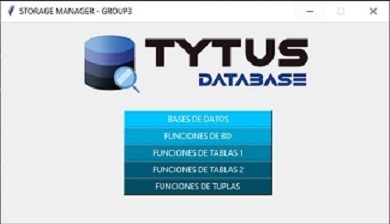
</p>


2. **Bases de datos**

   Esta opción nos mostrará todas las bases de datos existentes, al seleccionar un base de datos en especifico se puede visualizar las tablas que contiene dicha base de datos Y seleccionar una tabla en especifico para visualizar los registros dentro de la tabla.

<p align="center">
  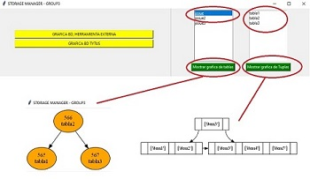
</p>

3. **Funciones de BD** 

* **Crear BD** 
 Crea una base de datos. 

**Parámetro database:** es el nombre de la base de datos, debe cumplir con las reglas de identificadores de SQL.

**Valor de retorno:** 0 operación exitosa, 1 error en la operación, 2 base de datos existente

```
def createDatabase(database: str) -> int:
```
<p align="center">
  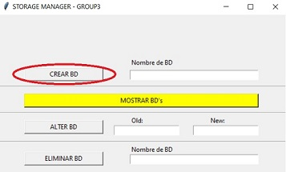
</p>

* **Alter BD**
Renombra la base de datos databaseOld por databaseNew. (UPDATE)

**Parámetro databaseOld:** es el nombre actual de la base de datos, debe cumplir con las reglas de identificadores de SQL.

**Parámetro databaseNew:** es el nuevo nombre que tendrá de la base de datos databaseOld, debe cumplir con las reglas de identificadores de SQL.

**Valor de retorno:** 0 operación exitosa, 1 error en la operación, 2 databaseOld no existente, 3 databaseNew existente.
```
def alterDatabase(databaseOld, databaseNew) -> int:
```
<p align="center">
  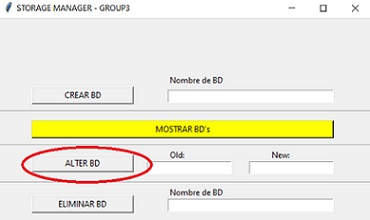
</p>


* **Eliminar BD**
Elimina por completo la base de datos indicada en database. (DELETE)

**Parámetro database:** es el nombre de la base de datos que se desea eliminar, debe cumplir con las reglas de identificadores de SQL.

**Valor de retorno:** 0 operación exitosa, 1 error en la operación, 2 base de datos no existente.

```
def dropDatabase(database: str) -> int: 
```
<p align="center">
  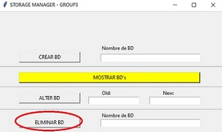
</p>

4. **Funciones de Tablas 1**

* **Create Table**
Crea una tabla en una base de datos especificada recibiendo una lista de índices referentes a la llave primaria y llave foránea. (CREATE)

**Parámetro database:** es el nombre de la base de datos a utilizar.

**Parámetro table:** es el nombre de la tabla que se desea crear.

**Parámetro numberColumns:** es el número de columnas que tendrá cada registro de la tabla.

**Valor de retorno:** 0 operación exitosa, 1 error en la operación, 2 base de datos inexistente, 3 tabla existente.

```
def createTable(database: str, table: str, numberColumns: int) -> int:
```
<p align="center">
  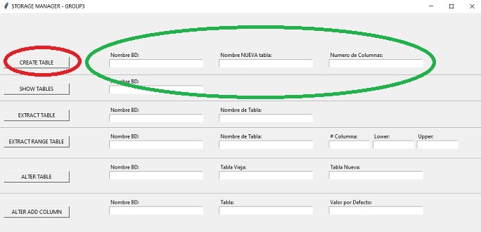
</p>

* **Show Tables**
Devuelve una lista de los nombres de las tablas de una base de datos. (READ)

**Parámetro database:** es el nombre de la base de datos a utilizar.

**Valor de retorno:** si existen la base de datos y las tablas devuelve una lista de nombres de tablas; si existe la base de datos, pero no existen tablas devuelve una lista vacía; y si no existe la base de datos devuelve None.

```
def showTables(database: str) -> list:
```

<p align="center">
  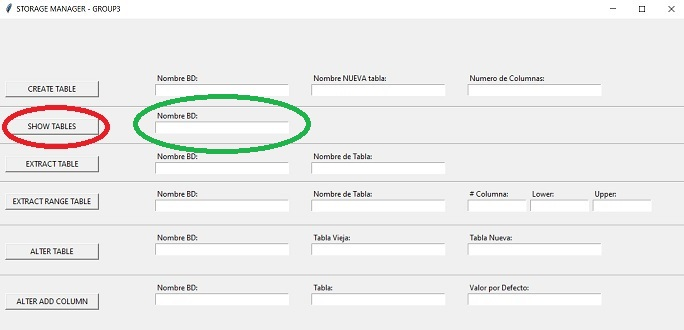
</p>
* **Extract Table**
Extrae y devuelve una lista con elementos que corresponden a cada registro de la tabla. (READ)

**Parámetro database:** es el nombre de la base de datos a utilizar.

**Parámetro table:** es el nombre de la tabla a utilizar.

**Valor de retorno:** si existe la base de datos, la tabla y los registros devuelve una lista con los registros, si existen las base de datos, la tablas pero no registros devuelve una lista vacía, y si ocurre un error o si no existe la base de datos o la tabla devuelve None

```
def extractTable(database: str, table: str) -> list:
```
<p align="center">
  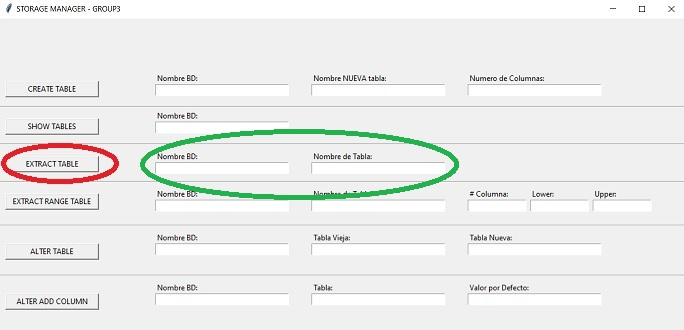
</p>

* **ExtractRange Table**
Extrae y devuelve una lista con los elementos que corresponden a un rango de registros de la tabla. (READ)

**Parámetro database:** es el nombre de la base de datos a utilizar.
Parámetro table: es el nombre de la tabla a utilizar.

**Parámetro columnNumber:** es el número de índice de columna a restringir o verificar con los valores upper y lower.

**Parámetro lower:** es el límite inferior (inclusive) del rango a extraer de la columna indicada de la tabla.

**Parámetro upper:** es el límite superior (inclusive) del rango a extraer de la columna indicada de la tabla.

**Valor de retorno:** si existe la base de datos, la tabla y los registros devuelve una lista con los registros(lista), si existen las base de datos, la tablas pero no registros devuelve una lista vacía, y si no existe la base de datos o la tabla o cualquier error devuelve None.

**Consideraciones:**
•	Para la comparación de lower y upper se puede hacer cast a str cuando las llaves sean compuestas o en general para reducir complejidad.
•	Ver el submódulo Any del paquete typing.

```
def extractRangeTable(database: str, table: str, columnNumber: int, lower: any, upper: any) -> list:
```
<p align="center">
  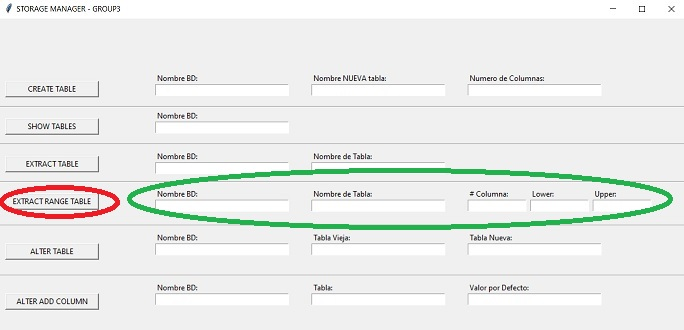
</p>

* **Alter Table**
Renombra el nombre de la tabla de una base de datos especificada. (UPDATE)

**Parámetro database:** es el nombre de la base de datos a utilizar.

**Parámetro tableOld:** es el nombre de la tabla a renombrar.

**Parámetro tableNew:** es el nuevo nombre con que renombrará la tableOld.
Valor de retorno: 0 operación exitosa, 1 error en la operación, 2 database no existente, 3 tableOld no existente, 4 tableNew existente.

```
def alterTable(database: str, tableOld: str, tableNew: str) -> int:
```
<p align="center">
  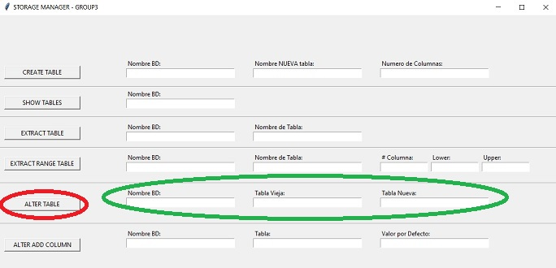
</p>

* **Alter Add Column**
Agrega una columna al final de cada registro de la tabla y base de datos especificada. (UPDATE) 

**Parámetro database:** es el nombre de la base de datos a utilizar.
Parámetro table: es el nombre de la tabla a modificar.

**Parámetro default:** es el valor que se establecerá en a la nueva columna para los registros existentes.

**Valor de retorno:** 0 operación exitosa, 1 error en la operación, 2 database no existente, 3 table no existente.

```
def alterAddColumn(database: str, table: str, default: any) -> int:
```

<p align="center">
  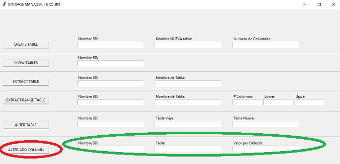
</p>

5. **Funciones de Tablas 2**

* **Alter Drop Colum**
Eliminar una n-ésima columna de cada registro de la tabla excepto si son llaves primarias. (DELETE)

**Parámetro database:** es el nombre de la base de datos a utilizar.

**Parámetro table:** es el nombre de la tabla a modificar.

**Valor de retorno:** 0 operación exitosa, 1 error en la operación, 2 database no existente, 3 table no existente, 4 llave no puede eliminarse o tabla quedarse sin columnas, 5 columna fuera de límites.

```
def alterDropColumn(database: str, table: str, columnNumber: int) -> int:
```
<p align="center">
  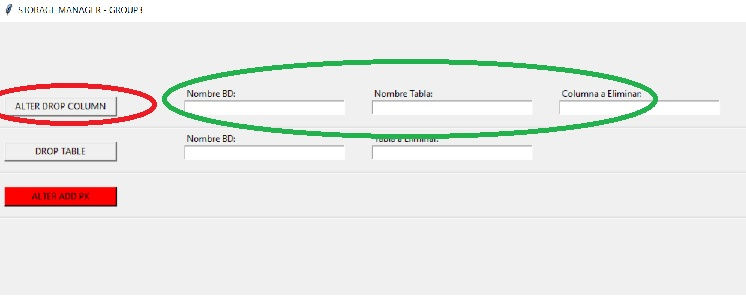
</p>

* **Drop Table**
 Elimina por completo una tabla de una base de datos especificada. (DELETE)

**Parámetro database:** es el nombre de la base de datos a utilizar.

**Parámetro table:** es el nombre de la tabla a eliminar.

**Valor de retorno:** 0 operación exitosa, 1 error en la operación, 2 database no existente, 3 table no existente.

```
def dropTable(database: str, table: str) -> int:
```
<p align="center">
  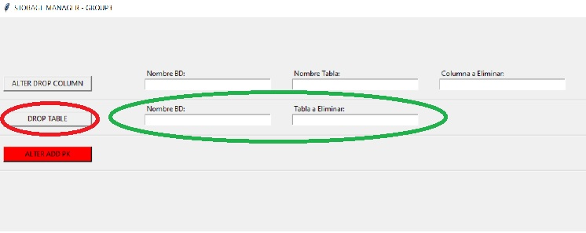
</p>