### Integrantes:

 - 201701160 - MARÍA ZUCELY HERNÁNDEZ GARCÍA 
 - 201708975 - DOUGLAS JOSUE MARTINEZ HUIT
 - 201709003 - PABLO JOSUE AYAPAN VARGAS
 - 201709073 - WALTER ALEXANDER GUERRA DUQUE

# **TytusDB - Documentación - G8**
## **Manual de Usuario**
### **Descripción**
Es un proyecto Open Source para desarrollar un administrador de bases de datos. Está compuesto por tres componentes interrelacionados: el administrador de almacenamiento de la base de datos, el administrador de la base de datos, este administrador se compone a su vez de un servidor y de un cliente; y el SQL Parser.
###	**Advertencias**
El proyecto está diseñado por el catedrático bajo una licencia Open Source, específicamente MIT. Por convenio, los estudiantes aparecerán como contribuidores junto con el copyright.
### **Consejos**
Verificar bien los datos de ingreso para evitar errores inesperados al momento de su uso.
 1. **Administrador de Almacenamiento:** Este componente es el encargado de gestionar el almacenamiento de las bases de datos, proporcionando al servidor un conjunto de funciones para extraer la información. Dentro de este manual, el enfoque será sobre este componente.
 
Toda la información generada se guarda en archivos "**.bin**" para poder hacer una carga de datos más rápida.
 ### **Uso de la Aplicación**
 1. **Carga de datos**  
 Se debe cargar los datos de la aplicación, si en dado caso no hay datos cargados, se le indicará y podrá continuar con el uso normal de la aplicación, pero deberá ingresar los datos manualmente.  
<p align="center">
 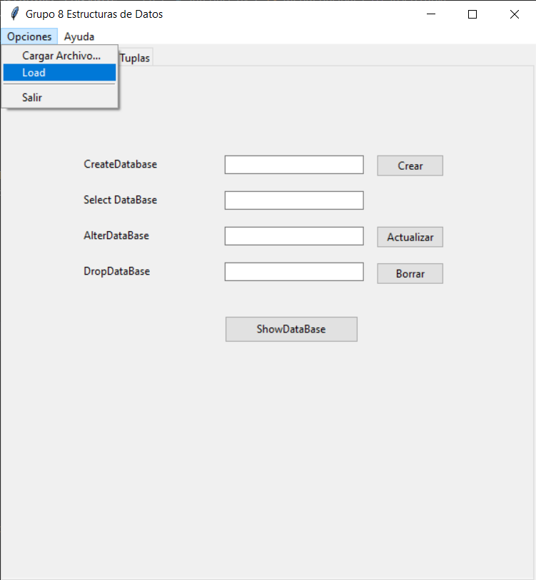
</p>  

 2. **Crear Nueva Base de Datos**  
 Para esto, basta con llenar el campo de **CreateDatabase** y presionar el botón crear. Resivirá un aviso si la operación fue exitosa o si hubo un error.   
<p align="center">

</p>

```
def createDatabase(database: str):
```
**Parámetro database**: es el nombre de la base de datos.  
**Valor de retorno**: 0 operación exitosa, 1 error en la operación, 2 base de datos existente.  

 3. **Mostrar Bases de Datos**  
 Esta opción mostrará todas las bases de datos existentes en el sistema. Basta con presionar el botón **ShowDataBase**.  
<p align="center">
 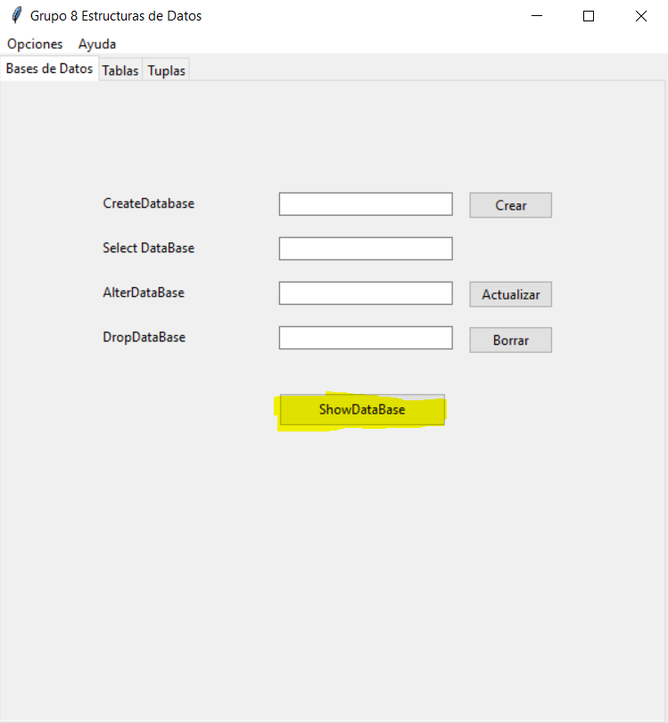
</p>

```
def showDatabases():
```
**Valor de retorno**: lista de strings con los nombres de las bases de datos, si ocurrió un error o no hay bases de datos devuelve una lista vacía [].

 4. **Renombrar Base de Datos**  
 Tal y como su nombre lo dice, esta opción sirve para renombrar una base de datos existente. Basta con llenar los campos **CreateDatabase**, **AlterDataBase** y luego presionar el botón **Actualizar**.
 
<p align="center">
 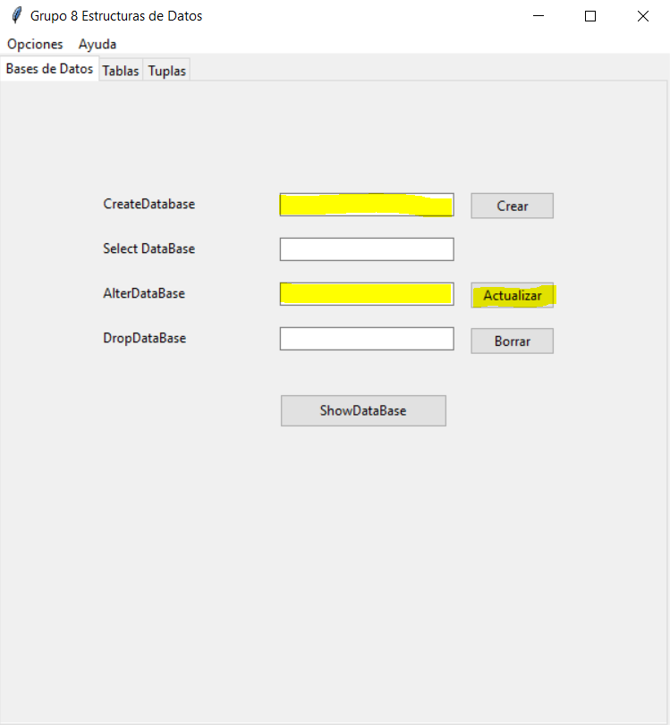
</p>

```
def alterDatabase(databaseOld, databaseNew):
``` 
**Parámetro databaseOld**: es el nombre actual de la base de datos.  
**Parámetro databaseNew**: es el nuevo nombre que tendrá de la base de datos databaseOld.  
**Valor de retorno**: 0 operación exitosa, 1 error en la operación, 2 databaseOld no existente, 3 databaseNew existente.  

 5. **Eliminar Base de Datos**  
 Con esta opción se puede eliminar un base de datos por completo. Basta con llenar el campo **DropDataBase** y presionar el botón **Borrar**.  
<p align="center">
 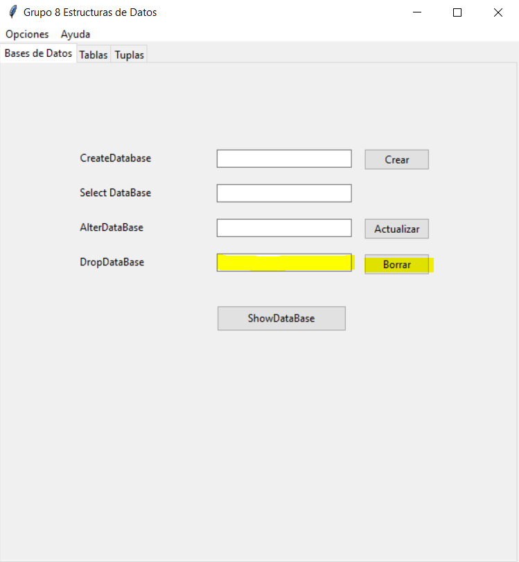
</p>

```
def dropDatabase(database: str): 
```
**Parámetro database**: es el nombre de la base de datos que se desea eliminar.  
**Valor de retorno**: 0 operación exitosa, 1 error en la operación, 2 base de datos no existente.  

 6. **Crear Tabla**  
 Con esta opción se puede crear una tabla dentro de una **DB** en específico. Basta con llenar los campos **Seleccionar DB**, **Table** y presionar el botón **Create**.  
<p align="center">
 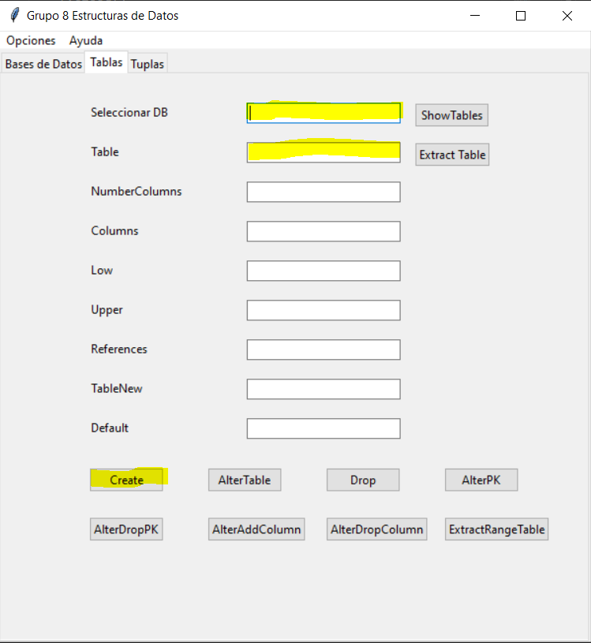
</p>

```
def createTable(database: str, table: str, numberColumns: int):
```
**Parámetro database**: es el nombre de la base de datos a utilizar.  
**Parámetro table**: es el nombre de la tabla que se desea crear.  
**Parámetro numberColumns**: es el número de columnas que tendrá cada registro de la tabla.  
**Valor de retorno**: 0 operación exitosa, 1 error en la operación, 2 base de datos inexistente, 3 tabla existente.  

 7. **Mostrar Tablas**  
 Se despliega un listado con las tablas pertenecientes a una **DB** en específico. Basta con llenar el campo **Seleccionar DB** y presionar el botón **ShowTables**.  
<p align="center">
 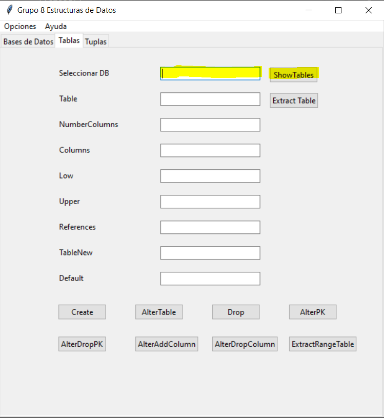
</p>

```
def showTables(database: str):
```
**Parámetro database**: es el nombre de la base de datos a utilizar.  
**Valor de retorno**: si existen la base de datos y las tablas devuelve una lista de nombres de tablas; si existe la base de datos, pero no existen tablas devuelve una lista vacía; y si no existe la base de datos devuelve None.  

 8. **Registros de una Tabla**  
 Extrae y devuelve una lista con elementos que corresponden a cada registro de la tabla. Basta con llenar los campos **Seleccionar DB**, **Table** y presionar el botón **Extract Table**.  
<p align="center">
 
</p>

```
def extractTable(database: str, table: str):
```
**Parámetro database**: es el nombre de la base de datos a utilizar.  
**Parámetro table**: es el nombre de la tabla a utilizar.  
**Valor de retorno**: si existe la base de datos, la tabla y los registros devuelve una lista con los registros, si existen las base de datos, la tablas pero no registros devuelve una lista vacía, y si ocurre un error o si no existe la base de datos o la tabla devuelve None.  

 9. **Rango de Registros de una Tabla**  
 Extrae y devuelve una lista con los elementos que corresponden a un rango de registros de la tabla. Basta con llenar los campos **Seleccionar DB**, **Table**, **Columns**, **Low**, **Upper** y presionar el botón **ExtractRangeTable**.  
<p align="center">
 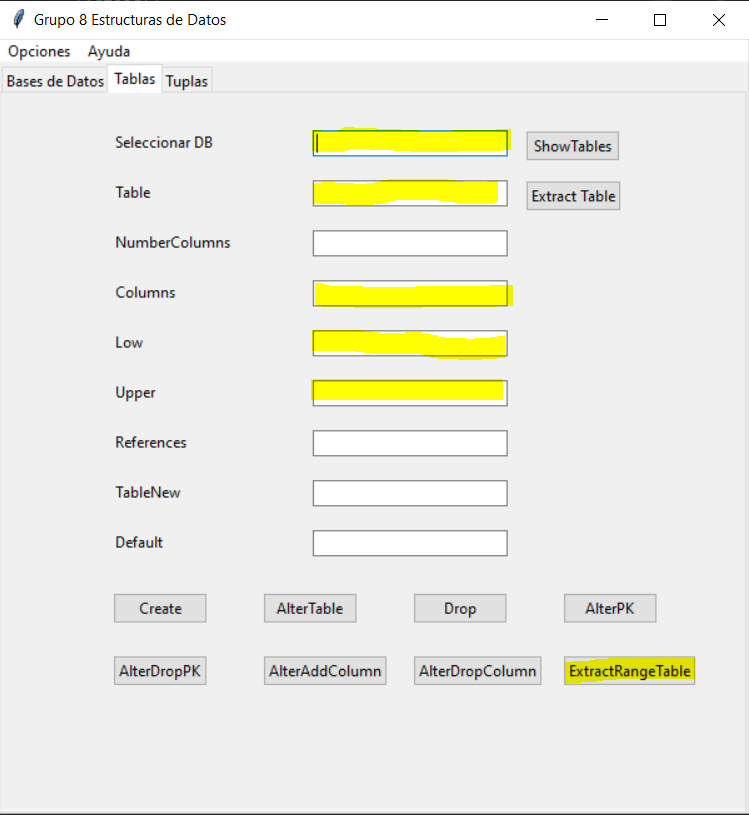
</p>

```
def extractRangeTable(database: str, table: str, columnNumber: int, lower: any, upper: any):
```
**Parámetro database**: es el nombre de la base de datos a utilizar.  
**Parámetro table**: es el nombre de la tabla a utilizar.  
**Parámetro columnNumber**: es el número de índice de columna a restringir o verificar con los valores upper y lower.  
**Parámetro lower**: es el límite inferior (inclusive) del rango a extraer de la columna indicada de la tabla.  
**Parámetro upper**: es el límite superior (inclusive) del rango a extraer de la columna indicada de la tabla.  
**Valor de retorno**: si existe la base de datos, la tabla y los registros devuelve una lista con los registros(lista), si existen las base de datos, la tablas pero no registros devuelve una lista vacía, y si no existe la base de datos o la tabla o cualquier error devuelve None.

 10. **Renombrar Tabla**  
 Renombra el nombre de la tabla de una base de datos especifica. Basta con llenar los campos **Seleccionar DB**, **Table**, **TableNew** y presionar el botón **AlterTable**.  
<p align="center">
 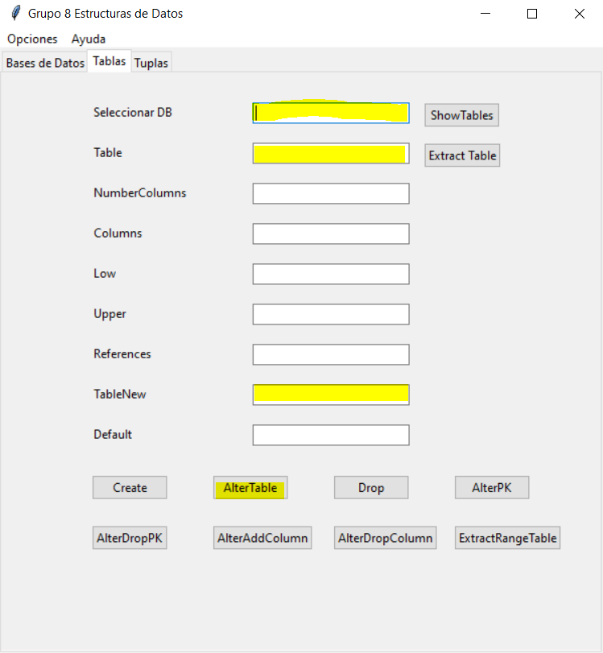
</p>

```
def alterTable(database: str, tableOld: str, tableNew: str):
```
**Parámetro database**: es el nombre de la base de datos a utilizar.  
**Parámetro tableOld**: es el nombre de la tabla a renombrar.  
**Parámetro tableNew**: es el nuevo nombre con que renombrará la tableOld.  
**Valor de retorno**: 0 operación exitosa, 1 error en la operación, 2 database no existente, 3 tableOld no existente, 4 tableNew existente.  

 11. **Eliminar Tabla**  
 Elimina por completo una tabla de una base de datos especifica. Basta con llenar los campos **Seleccionar DB**, **Table** y presionar el botón **Drop**.  
<p align="center">
 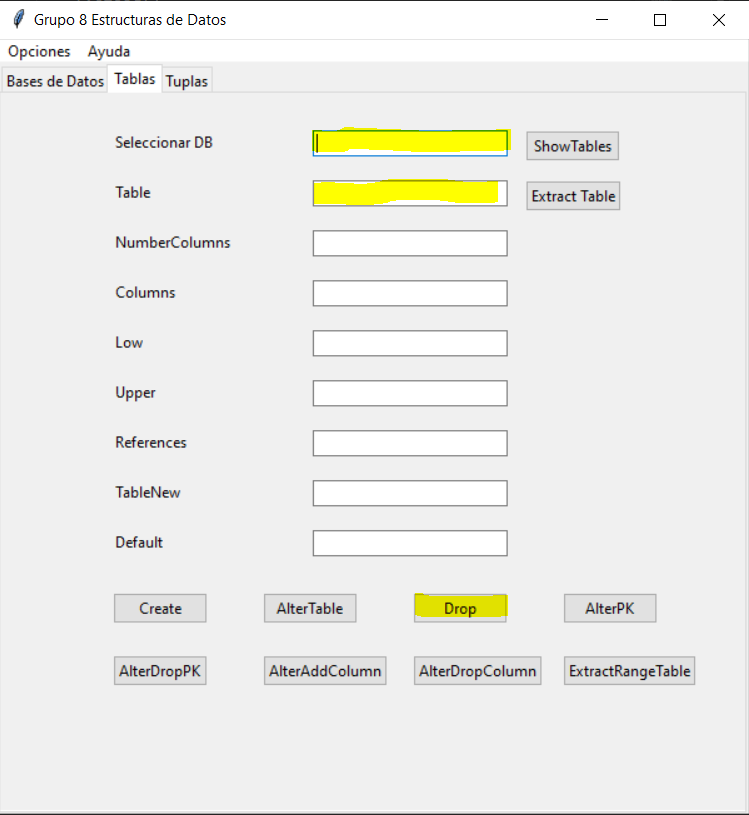
</p>

```
def dropTable(database: str, table: str): 
```
**Parámetro database**: es el nombre de la base de datos a utilizar.  
**Parámetro table:** es el nombre de la tabla a eliminar.  
**Valor de retorno**: 0 operación exitosa, 1 error en la operación, 2 database no existente, 3 table no existente.  

 12. **Agregar Registro a Tabla**  
 Inserta un registro en la estructura de datos asociada a la tabla y la base de datos. Basta con llenar los campos **Seleccionar DB**, **Table**, **File** que es una dirección de un archivo para que sea leído, este puede ser cargado con el botón **LoadCSV**, una vez realizado lo anterior se presiona el botón **Insert**.  
<p align="center">
 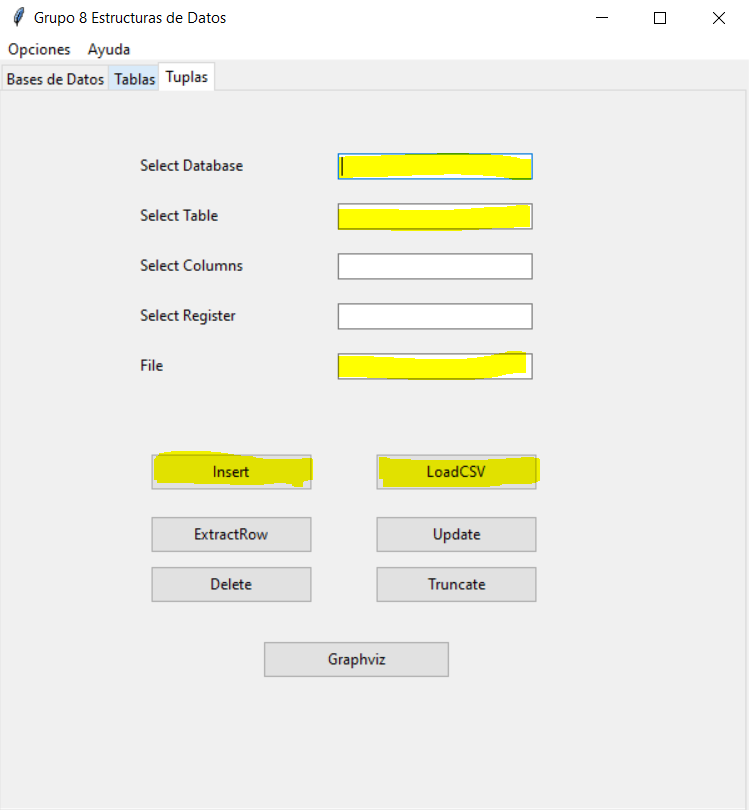
</p>

```
def insert(database: str, table: str, register: list):
```
**Parámetro database**: es el nombre de la base de datos a utilizar.  
**Parámetro table**: es el nombre de la tabla a utilizar.  
**Parámetro register**: es una lista de elementos que representan un registro.  
**Valor de retorno**: 0 operación exitosa, 1 error en la operación, 2 database no existente, 3 table no existente, 4 llave primaria duplicada, 5 columnas fuera de límites.  

 13. **Cargar Archivo de Entrada**  
 Carga un archivo CSV de una ruta especificada indicando la base de datos y tabla donde será almacenado. La base de datos y la tabla deben existir, y coincidir con el número de columnas. Basta con presionar el botón **LoadCSV** el cual abrirá el explorador de archivos y basta con seleccionar el archivo y abrirlo.  
<p align="center">
 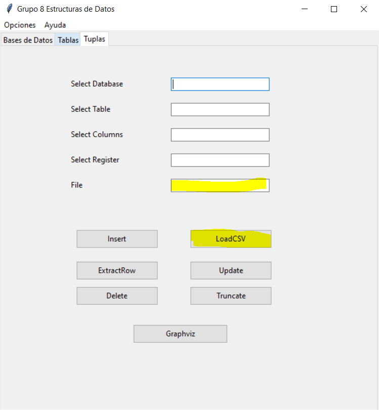
</p>

```
def loadCSV(file: str, database: str, table: str):
```
**Parámetro database**: es el nombre de la base de datos a utilizar.  
**Parámetro table**: es el nombre de la tabla a utilizar.  
**Valor de retorno**: lista con los valores enteros que devuelve el insert por cada fila del CSV, si ocurrió un error o el archivo CSV no tiene filas devuelve una lista vacía [].  

 14. **Extrac Row**  
 Extrae y devuelve un registro especificado por su llave primaria. Esta función es usada internamente por **8.** y **9.** 

```
def extractRow(database: str, table: str, columns: list):
```
**Parámetro database**: es el nombre de la base de datos a utilizar.  
**Parámetro table**: es el nombre de la tabla a utilizar.  
**Parámeto columns**: es la llave primaria.  
**Valor de retorno**: lista con los valores del registro, si ocurrió un error o no hay registro que mostrar devuelve una lista vacía.  

### **Requisitos del Sistema**  
- Instalado **Python 3.8** o superior.
- Funciones de **Graphviz** y **.dot**, instaladas.
- De preferencia **W10**.
- 4 Gb **ram**.
- **Intel i3** o similar/superior.  
  

## **Manual Técnico**  
En este caso, **TytusDB** fue desarollado haciendo uso de dos estructuras de datos para gestionar el almacenamiento, estas son: **Árbol AVL** y **Árbol B+**
### **Árbol AVL**  
Un árbol AVL (Adelson–Velskii y Landis) es un árbol binario de búsqueda  que satisface la condición de estar balanceado.  
Por ser un Árbol Binario de Búsqueda respeta la propiedad de orden en todos sus nodos, es decir, todas las claves en su subárbol izquierdo son menores que la clave del nodo y todas las claves en el subárbol derecho son mayores.  
La propiedad de balanceo dice que para cada nodo del árbol, la diferencia de altura entre el subárbol izquierdo y el subárbol derecho es a lo sumo 1.  
Se hizo uso de este árbol para el almacenamiento de **Bases de Datos** y **Tablas**.  
Para facilitar el ingreso y balanceo de datos y tomando en cuenta que los datos de ingreso son **str** y no **int**, se usó una función para poder convertir los valores **str** a su equivalente en código **ASCII** y con este valor poder realizar la carga del **Árbol AVL**. A su vez, a cada nodo del árbol se le asignó los parámetros que requerían para cumplir con todas las funciones de **TytusDB**.  
### **Funciones Implementadas con Árbol AVL**
1. **Insertar Nuevo Nodo**  
Se aplica tanto para Bases como para Tablas.
    ```
    def createTable(self, nomDTB, nomTBL, numCOl):
    def _createTable(self, nomDTB, nomTBL, numCOL, tmp):
    ```
    **Parámentro tmp**: Es el nodo por el cual está pasando el recorrido dentro del árbol.  

2. **Rotaciones**  

    **Simple por la Izquierda**
    ```
    def srl(self, t1):
    ```  
    **Simple por la Derecha**
    ```
    def srr(self, t1):
    ```  
    **Doble por la izquierda**:  
    ```
    def drl(self, tmp):
    ```
    **Doble por la derecha**:  
    ```
    def drr(self, tmp):
    ```
3. **Utilidades**  

    **Obtener Valor ASCII**  
    ```
    def jalarValN(self, vali):
    ```  
    **Obtener Nivel del Nodo**:  
    ```
    def nivel(self, tmp):
    ```  
    **Obtener nivel Padre**:
    ```
    def maxi(self, r, l):
    ```  
    **Balancear de Nuevo**:  
    ```
    def Balance(self, tmp):
    ```  
    **Obtener el nodo Menor**:
    ```
    def leMenor(self, tmp):
    ```  

### **Árbol B+**  
Son una variante de los árboles B, se diferencian  en que los árboles B+ toda la informacion se encuentra almacenada en las hojas. En la raíz y en las páginas internas se encuentran almacenado índices o claves para llegar a un dato.  
- La raíz almacena como mínimo un dato y como máximo m-1 datos.
- La página raíz tiene como mínimo dos descendientes.
- Las páginas intermedias tienen como mínimo (m-1)/2(Parte entera) datos.  
- Las páginas intermedias tienen como máximo m-1 datos.  
- Todas las paginas hojas tienen la misma altura.  
- La informacion se encuentra ordenada.  
- Toda la informacion se encuentra almacenada en  las páginas hoja, por lo que en las páginas internas se puede duplicar las claves.  

El **Árbol B+** se ultilizó para almacenar las tuplas de cada tabla. Se usó un árbol de orden 4.  

### **Funciones Implementadas con Árbol B+**  

1. **Agregar**  
    Para poder agregar al **Árbol B+** se hace uso de seis funciones:  
    ```
    def insert(self, nomDTB, nomTBL, registro):
    ```
    ```
    def agregar(self, key, nomDTB, nomTBL, registro):
    ```
    ```
    def split(self):
    ```
    ```
    def is_full(self):
    ```
    ```
    def unir(self, parent, hijo, index):
    ```
    ```
    def buscar(self, node, key):
    ```
