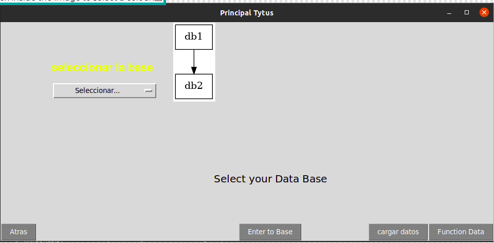
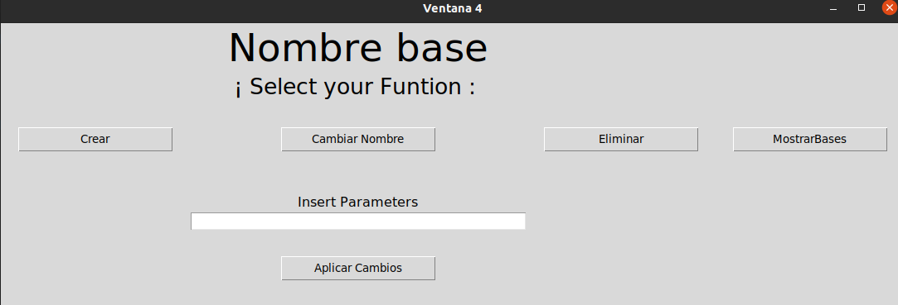
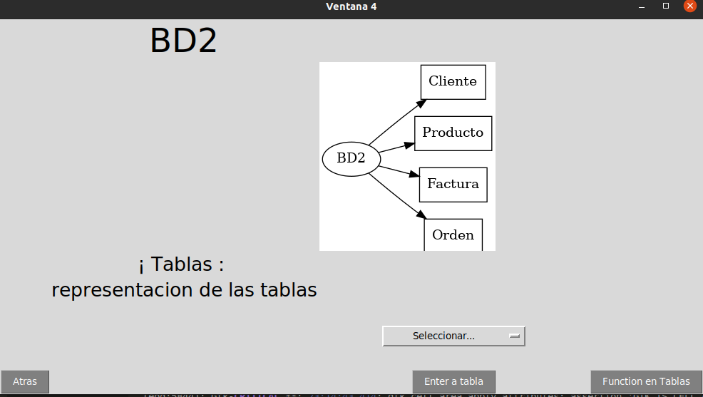
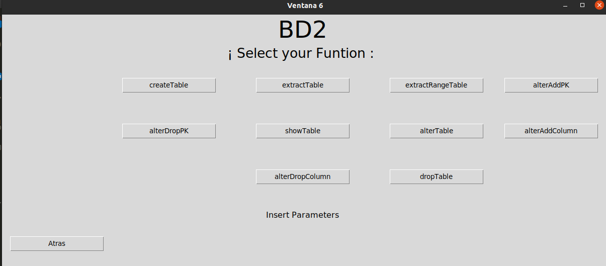
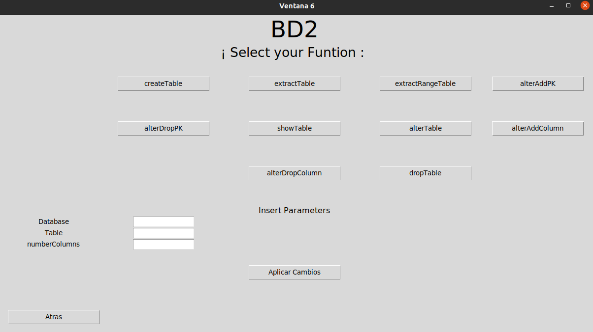

# Manual de Usuario EDD_Grupo 9

## Funciones Generales
  ### Funcionalidades en Bases de datos
*  ### Creacion de bases de datos
* Solo se ingresa el nombre de la base de datos **debe de cumplir con las reglas de indentificadores en SQL**
El valor de retorno es un entero que debe de cumplir con lo siguiente:
	*	0 --> Operacion Exitosa
	* 	1 --> Error en la operacion
	*	2 --> Base de Datos Existente
```python
	def createDatabase(database: str) -> int:
```

*  ### Visualizacion de bases de datos
El valor de retorno es un arreglo que cambia segun los datos

* [None]-->  Arreglo Vacio
* [Data1,Data2,Data3] --> Arreglo Con los datos
```python
	def showDatabases() -> list:
```

*  ### Modifica Nombre de bases de datos
* Parametros: 

	* databaseOld: Nombre de la base de datos que se quiere modificar 
	* databaseNew: Nombre Nuevo de la base de datos

	El valor de retorno es un entero que debe de cumplir con lo siguiente:
	*  0 --> Operacion Exitosa
	*  1 --> Error en la operacion
	*  2 --> Base de Datos No Existente
	*  3 --> Base de Datos Existente
```python
	def alterDatabase(databaseOld, databaseNew) -> int:
```
	

*  ### Eliminacion de bases de datos
* Solo se ingresa el nombre de la base de datos **debe de cumplir con las reglas de indentificadores en SQL**
El valor de retorno es un entero que debe de cumplir con lo siguiente:
	*	0 --> Operacion Exitosa
	* 	1 --> Error en la operacion
	*	2 --> Base de Datos Existente
```python
	def dropDatabase(database: str) -> int: 
```
##	   Funcionalidades en Tablas

*  ### Creacion de tablas en bases de datos
* **database:** es el nombre de la base de datos a utilizar.	

* **table:** es el nombre de la tabla que se desea crear.

* **numberColumns:** es el número de columnas que tendrá cada registro de la tabla.

El valor de retorno es un entero que debe de cumplir con lo siguiente:

* 0 --> Operacion Exitosa
* 1 --> Error en la operacion
* 2 --> Base de Datos Existente
	
	
```python
	def createTable(database: str, table: str, numberColumns: int) -> int:
```

*  ### Visualizacion tablas en la bases de datos
El valor de retorno es un arreglo que cambia segun los datos
*	[	]-->  Arreglo Vacio si no hay tablas en la base de datos
* 	[Data1,Data2,Data3] --> Arreglo Con las tablas en dicha base
*	None --> Si no existe la base de datos
```python
	def showTables(database: str) -> list:
```

*  ### Visualizar una tabla especifica de la  bases de datos
* **database:** es el nombre de la base de datos a utilizar.
* **table:** es el nombre de la tabla que se desea crear.
El valor de retorno es un arreglo que cambia segun los datos
	*	[	]-->  Arreglo Vacio si no hay tablas en la base de datos
	* 	[Data1,Data2,Data3] --> Arreglo Con las tablas en dicha base
	*	None --> Si no existe la base de datos
```python
	def extractTable(database: str, table: str) -> list:
```

*  ### Visualiza una tabla con un rango especifico de la  bases de datos
* **database:** es el nombre de la base de datos a utilizar.
* **table:** es el nombre de la tabla que se desea crear.
* **columnNumber:** es el número de índice de columna a restringir o verificar con los valores upper y lower.
* **upper:** es el límite superior (inclusive) del rango a extraer de la columna indicada de la tabla.
* **lower:** es el límite inferior (inclusive) del rango a extraer de la columna indicada de la tabla.
El valor de retorno es un arreglo que cambia segun los datos
	*	[	]-->  Arreglo Vacio si no hay tablas en la base de datos
	* 	[Data1,Data2,Data3] --> Arreglo Con las tablas en dicha base
	*	None --> Si no existe la base de datos
```python
	def extractRangeTable(database: str, table: str, columnNumber: int, lower: any, upper: any) -> list:
```

*  ### Asocia llave primaria o compuesta en tablas de la bases de datos
* **database:** es el nombre de la base de datos a utilizar.
* **table:** es el nombre de la tabla que se desea crear.
* **columns:** es el listado de números de columnas que formarán parte de la llave primaria. 
El valor de retorno es un entero que debe de cumplir con lo siguiente:
	*	0 --> Operacion Exitosa
	* 	1 --> Error en la operacion
	*	2 --> Base de Datos no Existente
	*	3 --> Tabla no existe
	*	4 --> Llave Primaria Existe
	*	5 --> columnas fuera de límites.
```python
	def alterAddPK(database: str, table: str, columns: list) -> int:
```


*  ### Elimina la llave primaria actual en la información de la tabla en la base de datos
* **database:** es el nombre de la base de datos a utilizar.
* **table:** es el nombre de la tabla que se desea utilizar.
El valor de retorno es un arreglo que cambia segun los datos
	*	0 --> Operacion Exitosa
	* 	1 --> Error en la operacion
	*	2 --> Base de Datos no Existente
	*	3 --> Tabla no existe
	*	4 --> Llave Primaria no Existe
```python
	def extractTable(database: str, table: str) -> list:
```

*  ### Renombra el nombre de la tabla de una base de datos especificada
* Parametros: 
* **database:** es el nombre de la base de datos a utilizar.
* **tableOld:** es el nombre de la tabla a renombrar.
* **tableNew:** es el nuevo nombre con que renombrará la tableOld.
Valor de retorno: 0 operación exitosa, 1 error en la operación, 2 database no existente, 3 tableOld no existente, 4 tableNew existente.
	El valor de retorno es un entero que debe de cumplir con lo siguiente:
	*	0 --> Operacion Exitosa
	* 	1 --> Error en la operacion
	*	2 --> Base de Datos no Existente
	*	3 --> Tabla Antigua no existe
	*	4 --> Llave Primaria no Existe
	```python
		def alterTable(database: str, tableOld: str, tableNew: str) -> int:
	```

*  ### Agrega una columna al final de cada registro de la tabla y base de datos especificada
* **database:** es el nombre de la base de datos a utilizar.
* **table:** es el nombre de la tabla que se desea modificar.
* **default:** es el valor que se establecerá en a la nueva columna para los registros existentes.
El valor de retorno es un entero que debe de cumplir con lo siguiente:
	*	0 --> Operacion Exitosa
	* 	1 --> Error en la operacion
	*	2 --> Base de Datos no Existente
	*	3 --> Tabla no existe
```python
	def alterAddColumn(database: str, table: str, default: any) -> int:
```


*  ### Eliminar una n-ésima columna de cada registro de la tabla excepto si son llaves primarias.
* **database:** es el nombre de la base de datos a utilizar.
* **table:** es el nombre de la tabla que se desea eliminar.
El valor de retorno es un entero que debe de cumplir con lo siguiente:
	*	0 --> Operacion Exitosa
	* 	1 --> Error en la operacion
	*	2 --> Base de Datos no Existente
	*	3 --> Tabla no existe
	*	4 --> Lllave no puede eliminarse o tabla quedarse sin columnas
	*	5 --> columnas fuera de límites.
```python
	def alterDropColumn(database: str, table: str, columnNumber: int) -> int:
```


*  ### Elimina por completo una tabla de una base de datos especificada. 
* **database:** es el nombre de la base de datos a utilizar.
* **table:** es el nombre de la tabla que se desea eliminar.
El valor de retorno es un entero que debe de cumplir con lo siguiente:
	*	0 --> Operacion Exitosa
	* 	1 --> Error en la operacion
	*	2 --> Base de Datos no Existente
	*	3 --> Tabla no existe 
```python
	def alterDropColumn(database: str, table: str, columnNumber: int) -> int:
```
##	   Funcionalidades en Tuplas


*  ### Inserta un registro en la estructura de datos asociada a la tabla y la base de datos
* **database:** es el nombre de la base de datos a utilizar.
* **table:** es el nombre de la tabla que se desea utilizar
* **register:** es una lista de elementos que representan un registro.
El valor de retorno es un entero que debe de cumplir con lo siguiente:
	*	0 --> Operacion Exitosa
	* 	1 --> Error en la operacion
	*	2 --> Base de Datos Existente
	*	3 --> Tabla no existe
	*	4 --> Lllave primaria duplicada
	*	5 --> columnas fuera de límites.
```python
	 def insert(database: str, table: str, register: list) -> int:
```

*  ### Extrae y devuelve un registro especificado por su llave primaria.
* **database:** es el nombre de la base de datos a utilizar.
* **table:** es el nombre de la tabla que se desea utilizar.
* **columns:** es la llave primaria 
Valor de retorno: lista con los valores del registro, si ocurrió un error o no hay registro que mostrar devuelve una lista vacía [].
El valor de retorno es un entero que debe de cumplir con lo siguiente:
	*	[	]-->  Arreglo Vacio si no hay registro o hay algun error
	* 	[Data1,Data2,Data3] --> Lista con los valores del registro,
```python
	  def extractRow(database: str, table: str, columns: list) -> list:
```

*  ### Inserta un registro en la estructura de datos asociada a la tabla y la base de datos.
* **database:** es el nombre de la base de datos a utilizar.
* **table:** es el nombre de la tabla que se desea utilizar.
* **register:** es una lista de elementos llave:valor que representa los elementos a actualizar del registro. La llave el número de coluna y el valor el contenido del campo.
Valor de retorno: lista con los valores del registro, si ocurrió un error o no hay registro que mostrar devuelve una lista vacía [].
El valor de retorno es un entero que debe de cumplir con lo siguiente:
	*	0 --> Operacion Exitosa
	* 	1 --> Error en la operacion
	*	2 --> Base de Datos no Existente
	*	3 --> Tabla no existe
	*	4 --> Lllave Primaria no Existe
```python
	  def update(database: str, table: str, register: dict, columns: list) -> int: 
```

*  ### Elimina un registro de una tabla y base de datos especificados por la llave primaria.
* **database:** es el nombre de la base de datos a utilizar.
* **table:** es el nombre de la tabla que se desea utilizar.	
* **columns:** es la llave primaria.
El valor de retorno es un entero que debe de cumplir con lo siguiente:
	*	0 --> Operacion Exitosa
	* 	1 --> Error en la operacion
	*	2 --> Base de Datos no Existente
	*	3 --> Tabla no existe
	*	4 --> Lllave Primaria no Existe
```python
	 def delete(database: str, table: str, columns: list) -> int:
```

*  ### Elimina todos los registros de una tabla y base de datos.
* **database:** es el nombre de la base de datos a utilizar.
* **table:** es el nombre de la tabla que se desea utilizar.	
* **columns:** es la llave primaria.

El valor de retorno es un entero que debe de cumplir con lo siguiente:
	*	0 --> Operacion Exitosa
	* 	1 --> Error en la operacion
	*	2 --> Base de Datos no Existente
	*	3 --> Tabla no existe.
```python
	 def truncate(database: str, table: str) -> int:
```

*  ### Carga un archivo CSV de una ruta especificada indicando la base de datos y tabla donde será almacenado.
* **Informacion Importante :** La base de datos y la tabla deben existir, y coincidir con el número de columnas. Si hay llaves primarias duplicadas se ignoran. No se utilizan títulos de columnas y la separación es por comas. 
* **database:** es el nombre de la base de datos a utilizar.
* **table:** es el nombre de la tabla que se desea utilizar.
El valor de retorno es un entero que debe de cumplir con lo siguiente:
	*	[dato1,dato2,dato3] --> lista con los valores enteros que devuelve el insert por cada fila
	* 	[__] --> Lista Vacia, sucedio un error o el archivo no tiene filas
```python
	 def loadCSV(file: str, database: str, table: str) -> list: 
```


Para poder ingresar a cada funcion se debe de presionar cada boton
### Ventana Principal



Para poder ingresar a las funciones de las bases de datos se deben de presionar cada boton para que se acepten los parametros
### Ventana Funciones de bases de datos



Para poder ingresar a las tablas se debe de seleccionar una base de datos en el combobox el cual ese ingresa a la base para crear una tabla dentro de ella
### Ventana Tablas dentro de la base de datos



Para poder ingresar a las funciones de las tablas se debe de presionar la funcion que se desea para poder mostrar los campos necesarios para cada funcion
### Ventana de las funciones de las tablas

