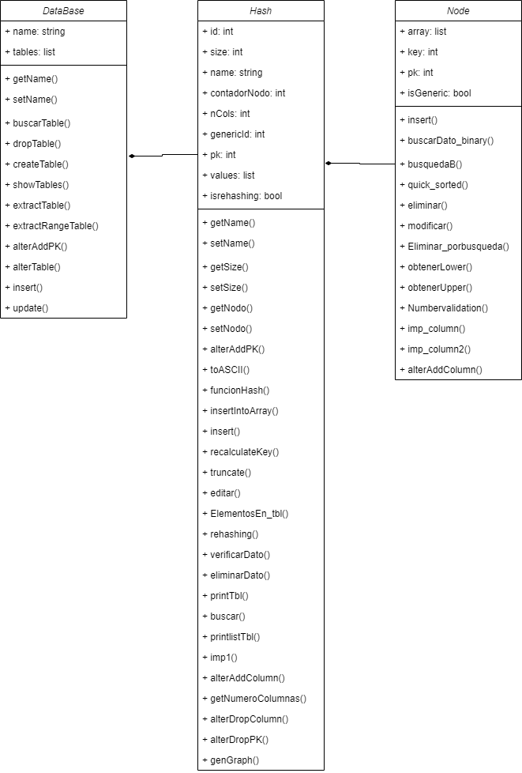

###### UNIVERSIDAD DE SAN CARLOS DE GUATEMALA
###### FACULTAD DE INGENIERÍA
###### INGENIERÍA EN CIENCIAS Y SISTEMAS
###### ESTRUCTURAS DE DATOS
###### SECCIÓN B
___
###### EQUIPO: 10
___
***

# **MANUAL TECNICO**
## ENTORNO DE DESARROLLO
- Versión de Python utilizada: 3.9.0
- Versión de Graphviz utilizada: 2.38.0
- Librería utilizada para la interfaz gráfica: Tkinter
&nbsp;
## DESCRIPCIÓN DE LA SOLUCIÓN
TytusDB es un administrador de base de datos Open Source, desarrollado en python, que adicionalmente permite diferentes modos de almacenamiento.
En está solución se utilizó como modo de almacenamiento para las tablas, una Tabla Hash, la cual es una estructura de datos muy buena ya que su orden de complejidad es lineal.
&nbsp;
## DESCRIPCIÓN DE CLASES
| Nombre | Descripción |
| ------ | ---------- |
| **DataBase** | Representa una base de datos, contiene todas las funcionalidades referente a esta. Contiene una lista de tablas (clase Hash). |
| **Hash** | Representa una tabla perteneciente a la base de datos, esta clase contiene todas las funcionalidades referente a una tabla de una base de datos. Esta contiene una lista de nodos (clase Node). |
| **Node** | Representa un nodo de la tabla hash, el cual contiene los registros guardados en un tabla. |
Todas las funciones referentes a TytusDB, se manejan a través de un paquete (Tytus.py) por medio del cual se hace la llamada a los métodos.
&nbsp;
## DIAGRAMA DE CLASES

&nbsp;
## DESCRIPCIÓN DE MÉTODOS
#### **createDatabase**
~~~
createDatabase(database: str) -> int
~~~
>**DESCRIPCIÓN**
Crea una nueva base de datos.
**PARÁMETROS**

| Parametro | Descripción | 
| --------- | ----------- |
| database (cadena) | Nombre que se le asignara a la base de datos al crearla |
>**RETORNOS**

| Retorno | Descripción |
| ------- | ----------- |
| 0 | Operación exitosa |
| 1 | Error en la operación |
| 2 | Base de datos existente |

&nbsp;
#### **showDatabases**
~~~
showDatabase()
~~~
>**DESCRIPCIÓN**
Devuelve una lista con todos los nombres de las bases de datos registradas.
**RETORNOS**

| Retorno | Descripción |
| ------- | ----------- |
| Lista | Contiene todos los nombres de las bases de datos creadas, si ocurre un error o no hay bases de datos registradas devuelve la lista vacía. |
&nbsp;
#### **alterDatabase**
~~~
alterDatabases(databaseOld: str, databaseNew: str) -> int
~~~
>**DESCRIPCIÓN**
Cambia el nombre de una base de datos.
**PARÁMETROS**

| Parametro | Descripción | 
| --------- | ----------- |
| databaseOld (cadena) | Nombre de la base de datos actual. |
| databaseNew (cadena) | Nombre nuevo que se le asignara a la base de datos.
>**RETORNOS**

| Retorno | Descripción |
| ------- | ----------- |
| 0 | Operación exitosa |
| 1 | Error en la operación |
| 2 | databaseOld no existente |
| 3 | databaseNew existente |
&nbsp;
#### **dropDatabase**
~~~
dropDatabase(database: str) -> int
~~~
>**DESCRIPCIÓN**
Elimina una base de datos.
**PARÁMETROS**

| Parametro | Descripción | 
| --------- | ----------- |
| database (cadena) | Nombre de la base de datos que se desea eliminar. |
>**RETORNOS**

| Retorno | Descripción |
| ------- | ----------- |
| 0 | Operación exitosa |
| 1 | Error en la operación |
| 2 | Base de datos no existente |
&nbsp;
#### **createTable**
~~~
createTable(database: str, table: str, numberColumns: int) -> int
~~~
>**DESCRIPCIÓN**
Crea una nueva tabla, en una base de datos especificada, y le asigna el número de columnas. 
**PARÁMETROS**

| Parametro | Descripción | 
| --------- | ----------- |
| database (cadena) | Nombre de la base de datos en la que se creara la tabla |
| table (cadena) | Nombre que se le asignara a la tabla creada |
| numberColumns (entero) | Número de columnas que tendrá la tabla |
>**RETORNOS**

| Retorno | Descripción |
| ------- | ----------- |
| 0 | Operación exitosa |
| 1 | Error en la operación |
| 2 | Base de datos inexistente |
| 3 | Tabla existente |
&nbsp;
#### **showTables**
~~~
showTable(database: str) -> list
~~~
>**DESCRIPCIÓN**
Devuelve una lista con los nombres de las tablas contenidas en la base de datos especificada.
**PARÁMETROS**

| Parametro | Descripción | 
| --------- | ----------- |
| database (cadena) | Nombre de la base de datos de la cual se desea obtener el nombre de sus tablas. |
>**RETORNOS**

| Retorno | Descripción |
| ------- | ----------- |
| lista (no vacía) | Si existe la base de datos y hay tablas en ella devuelve una lista con los nombres de las tablas. |
| lista (vacía) | La retorna si la base de datos no contiene tablas. |
| None | Valor devuelto si no existe la base de datos. |
&nbsp;
#### **extractTable**
~~~
extractTable(database: str, table: str)-> list
~~~
>**DESCRIPCIÓN**
Extrae y devuelve una lista con los elementos que corresponden a cada registro de una tabla especificada.
**PARÁMETROS**

| Parametro | Descripción | 
| --------- | ----------- |
| database (cadena) | Nombre de la base de datos que se utilizará. |
| table (cadena) | Nombre de la tabla que se utilizará. |
>**RETORNOS**

| Retorno | Descripción |
| ------- | ----------- |
| lista (no vacía) | Si existe la base de datos, la tabla y en ella registros, devuelve una lista con todos los registros.|
| lista (vacía) | Si existe la base de datos, la tabla pero está no contiene registros. |
| None | Si no existe la base de datos, la tabla u ocurre un errror. |
&nbsp;
#### **extractRangeTable**
~~~
extractRangeTable(database: str, table: str, columnNumber: int, lower: any, upper: any) -> list
~~~
>**DESCRIPCIÓN**
Extrae y devuelve una lista con los elementos que corresponden a un rango de registros en la tabla especificada.
**PARÁMETROS**

| Parametro | Descripción | 
| --------- | ----------- |
| database (cadena) | Nombre de la base de datos a utilizar. |
| table (cadena) | Nombre de la tabla a utilizar |
| columnNumber (entero) | Número de índice de la columna a restringir o verificar con los valores upper y lower. |
| lower (cualquiera) | Límite inferior(incluido) del rago a extraer de la columna indicada en la tabla utilizada. |
| upper (cualquiera) | Límite superior(incluido) del rago a extraer de la columna indicada en la tabla utilizada. |
>**RETORNOS**

| Retorno | Descripción |
| ------- | ----------- |
| lista (no vacía) | Si existe la base de datos, la tabla y registros, devuelve una lista con todos los registros. |
| lista (vacía) | Si existe la base de datos, la tabla pero no hay registros, devuelve la lista vacía. |
| None | Si no existe la base de datos, la tabla u ocurre un error |
&nbsp;
#### **alterAddPK**
~~~
alterAddPK(database: str, table: str, columns: list) -> list
~~~
>**DESCRIPCIÓN**
Asocia a la tabla especificada una llave primaria simple o compuesta mediante la lista de número de columnas, esto para anticipar el índice de la estructura de la tabla cuando se inserten registros.
**PARÁMETROS**

| Parametro | Descripción | 
| --------- | ----------- |
| database (cadena) | Nombre de la base de datos a utilizar. |
| table (cadena) | Nombre de la tabla a utilizar. |
| columns (lista) | Lista de números de columnas que formarán para de la llave primaria. |
>**RETORNOS**

| Retorno | Descripción |
| ------- | ----------- |
| 0 | Operació exitosa. |
| 1 | Error en la operación. |
| 2 | Database no existente. |
| 3 | Tabla no existente. |
| 4 | Llave primaria ya existente. |
| 5 | Columnas fuera de límites. |
&nbsp;
#### **alterDropPk**
~~~
alterDropPK(database: str, table: str) -> int
~~~
>**DESCRIPCIÓN**
Elimina la llave primaria actual en la información de la tabla, manteniendo el índice actual de la estructura, hasta que se invoque de nuevo el método alterAddPK().
**PARÁMETROS**

| Parametro | Descripción | 
| --------- | ----------- |
| database (cadena) | Nombre de la base de datos a utilizar. |
| table (cadena) | Nombre de la tabla a utilizar. |
>**RETORNOS**

| Retorno | Descripción |
| ------- | ----------- |
| 0 | Operación exitosa. |
| 1 | Error en la operación. |
| 2 | Base de datos no existente. |
| 3 | Tabla no existente. |
| 4 | Llave primaria no existente. |
&nbsp;
#### **alterTable**
~~~
alterTable(database: str, tableOld: str, tableNew: str) -> int
~~~
>**DESCRIPCIÓN**
Renombra una tabla en una base de datos especificada.
**PARÁMETROS**

| Parametro | Descripción | 
| --------- | ----------- |
| database (cadena) | Nombre de la base de datos utilizada. |
| tableOld (cadena) | Nombre de la tabla a renombrar. |
| tableNew (cadena) | Nombre con el que se renombrará la tabla. |
>**RETORNOS**

| Retorno | Descripción |
| ------- | ----------- |
| 0 | Operación exitosa. |
| 1 | Error en la operación. |
| 2 | Base de datos no existente. |
| 3 | Tabla a renombrar (tableOld) no existe. |
| 4 | El nombre con el que se desea renombrar la tabla (tableNew) ya existe. |
&nbsp;
#### **alterAddColumn**
~~~
alterAddColumn(database: str, table: str, default: any) -> int
~~~
>**DESCRIPCIÓN**
Agrega una columna al final de cada registro de una tabla y base de datos especificada.
**PARÁMETROS**

| Parametro | Descripción | 
| --------- | ----------- |
| database (cadena) | Nombre de la base de datos a utilizar. |
| table (cadena) | Nombre de la tabla a la que se le agregará la columna. |
| default (cualquiera) | Valor con el que se llenará la nueva columna agregada a la tabla. |
>**RETORNOS**

| Retorno | Descripción |
| ------- | ----------- |
| 0 | Operación exitosa. |
| 1 | Error en la operación. |
| 2 | Base de datos no existente. |
| 3 | Tabla no existente. |
&nbsp;
#### **alterDropColumn**
~~~
alterDropColumn(database: str, table: str, columnNumber: int) -> int
~~~
>**DESCRIPCIÓN**
Elimina una n-ésima columna de cada registro, excepto si son llaves primarias, de una tabla especificada.
**PARÁMETROS**

| Parametro | Descripción | 
| --------- | ----------- |
| database (cadena) | Nombre de la base de datos a utilizar. |
| table (cadena) | Nombre de la tabla a utilizar. |
| columnNumber (entero) | Número de columnna que se eliminara. |
>**RETORNOS**

| Retorno | Descripción |
| ------- | ----------- |
| 0 | Operación exitosa. |
| 1 | Error en la operación. |
| 2 | Base de datos no existente. |
| 3 | Tabla no existente. |
| 4 | Columna no puede eliminarse o la tabla se queda sin columnas si se realiza la operación. |
| 5 | Columna fuera de límites. |
&nbsp;
#### **dropTable**
~~~
dropTable(database: str, table: str) -> int
~~~
>**DESCRIPCIÓN**
Elimina una tabla por completo en una base de datos especificada.
**PARÁMETROS**

| Parametro | Descripción | 
| --------- | ----------- |
| database (cadena) | Nombre de la base de datos a utilizar. |
| table (cadena) | Nombre de la tabla a eliminar. |
>**RETORNOS**

| Retorno | Descripción |
| ------- | ----------- |
| 0 | Operación exitosa. |
| 1 | Error en la operación. |
| 2 | Base de datos no existente. |
| 3 | Tabla no existente. |
&nbsp;
#### **insert**
~~~
insert(database: str, table: str, register: list) -> int
~~~
>**DESCRIPCIÓN**
Inserta un registro en la estructura de datos asociada a la tabla y a la base de datos.
**PARÁMETROS**

| Parametro | Descripción | 
| --------- | ----------- |
| database (cadena) | Nombre de la base de datos a utilizar. |
| table (cadena) | Nombre de la tabla en donde se ingresaran los valores. |
| register (lista) | Lista de elementos de los datos que serán registrados. | 
>**RETORNOS**

| Retorno | Descripción |
| ------- | ----------- |
| 0 | Operación exitosa. |
| 1 | Error en la operación. |
| 2 | Base de datos no existente. |
| 3 | Tabla no existente. |
| 4 | LLave primaria duplicada. |
| 5 | Columnas fuera de límites. |
&nbsp;
#### **loadCSV**
~~~
loadCSV(file: str, database: str, table: str) -> list
~~~
>**DESCRIPCIÓN**
Carga un archivo .csv a la base de datos y tabla especificadas en donde se almacenarán los registros que el archivo contenga. El archivo CSV no debe contener títulos de columnas, y este debe estar separado por comas.
**PARÁMETROS**

| Parametro | Descripción | 
| --------- | ----------- |
| file (cadena) | Ruta en la cual se encuetra en archivo .csv que se desea cargar. |
| database (cadena) | Base de datos a utilizar. |
| table (cadena) | Tabla en la que se guaradarán los registros. |
>**RETORNOS**

| Retorno | Descripción |
| ------- | ----------- |
| lista (vacía) | Si ocurre un error o el archivo CSV no tiene filas, devuelve la lista vacía. |
&nbsp;
#### **extractRow**
~~~
extractRow(database: str, table: str, columns: list) -> list
~~~
>**DESCRIPCIÓN**
Extrae y devuelve un registro especificado por su llave primaria.
**PARÁMETROS**

| Parametro | Descripción | 
| --------- | ----------- |
| database (cadena) | Nombre de la base de datos a utilizar. |
| table (cadena) | Nombre de la tabla a utilizar. |
| columns (lista) | Llave primaria a utilizar, si es simple la lista solo contendrá un valor y si es compuesta contendrá varios.
>**RETORNOS**

| Retorno | Descripción |
| ------- | ----------- |
| lista (no vacía) | Lista con los valores del registro. |
| lista (vacía) | Si no hay un registro que mostrar, devuelve una lista vacía. |
&nbsp;
#### **update**
~~~
update(database: str, table: str, register: dict, columns:list) -> int
~~~
>**DESCRIPCIÓN**
Inserta un registro en la estructura de datos asociada a la tabla y a la base de datos especificada.
**PARÁMETROS**

| Parametro | Descripción | 
| --------- | ----------- |
| database (cadena) | Nombre de la base de datos a utilizar. |
| table (cadena) | Nombre de la tabla a utilizar. | 
| reister (lista) | Elementos llave:valor que representa los elementos a actualizar del registro. |
>**RETORNOS**

| Retorno | Descripción |
| ------- | ----------- |
| 0 | Operación exitosa. |
| 1 | Error en la operación. |
| 2 | Base de datos no existente. |
| 3 | Tabla no existente. |
| 4 | LLave primaria no existente. |
&nbsp;
#### **delete**
~~~
delete(database: str, table: str, columns: list) -> int
~~~
>**DESCRIPCIÓN**
Elimina un registro espesificado por su llave primaria, de una tabla y una base de datos especificada.
**PARÁMETROS**

| Parametro | Descripción | 
| --------- | ----------- |
| database (cadena) | Nombre de la base de datos a utilizar. |
| table (cadena) | Nombre de la tabla a utilizar. |
| columns (list) | Llaves primarias, si es simple la lista contendrá un solo valor, si es compuesta contendrá varios valores. |
>**RETORNOS**

| Retorno | Descripción |
| ------- | ----------- |
| 0 | Operación exitosa. |
| 1 | Error en la operación |
| 2 | Base de datos no existente. |
| 3 | Tabla no existente. |
| 4 | Llave primaria no existente. |
&nbsp;
#### **truncate**
~~~
truncate(database: str, table: str) -> int
~~~
>**DESCRIPCIÓN**
Elimina todos los registro de una tabla. 
**PARÁMETROS**

| Parametro | Descripción | 
| --------- | ----------- |
| database (cadena) | Nombre de la base de datos a utilizar.
| table (cadena) | Nombre de la tabla de la cual se borraran todos los registros.
>**RETORNOS**

| Retorno | Descripción |
| ------- | ----------- |
| 0 | Operación exitosa. |
| 1 | Error en la operación. |
| 2 | Base de datos no existente. |
| 3 | Tabla no existente.
&nbsp;
## TABLA HASH
### **Principales métodos**
#### funcionHash
Para poder almacenar un elemento en la tabla hash se de convertir su clave en un número. Esto se realiza mediante esta función. La cual practicamente asigna un número a cada elemento a insertar en la tabla a partir de su clave.
~~~
def funcionHash(self, dato, flag = False):
        if isinstance(dato, list):
            lenDato = 0
            res = ""
            if flag:
                for key in self.pk:
                    res += str(dato[key]) + ","
            else:
                for key in dato:
                    res += str(key) + ","
            lenDato = self.toASCII(res)
        return (int(lenDato % self.Size),lenDato)
~~~
#### toASCII
Convierte una cadena su código en ASCII
~~~
def toASCII(self, cadena):
        result = ""
        aux = 0
        comma = 0
        for char in cadena:
            if char != ",":
                result += str(ord(char))
            else:
                comma += int(ord(char))
                aux = int(result) + comma
                result = str(aux)
        return int(result)
~~~
#### rehashing
Redimenciona la Tabla Hash al llegar a un porcentaje de uso, el porcentaje de uso de la tabla hash es del 80%.
~~~
def rehashing(self):
        factorAgregado = int(self.Size * 0.80)
        if self.contadorNodo >= factorAgregado:
            #estoy_en_rehashing = True
            self.setSize( int(self.Size*4))
            self.inrehashing =True
            arrayAuxiliar = self.values[:]
            self.values.clear()
            self.values = [None]*self.Size
            lista = [tupla for nodo in arrayAuxiliar if nodo is not None for tupla in nodo.array]
            for j in lista:
                self.insert(j[1])
            arrayAuxiliar.clear()
            self.inrehashing = False
~~~
