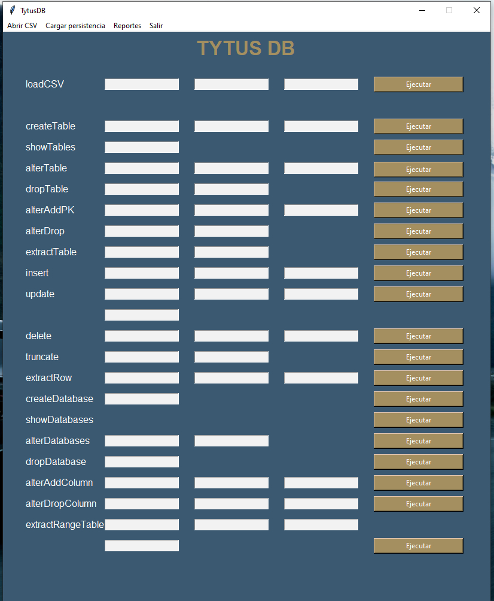
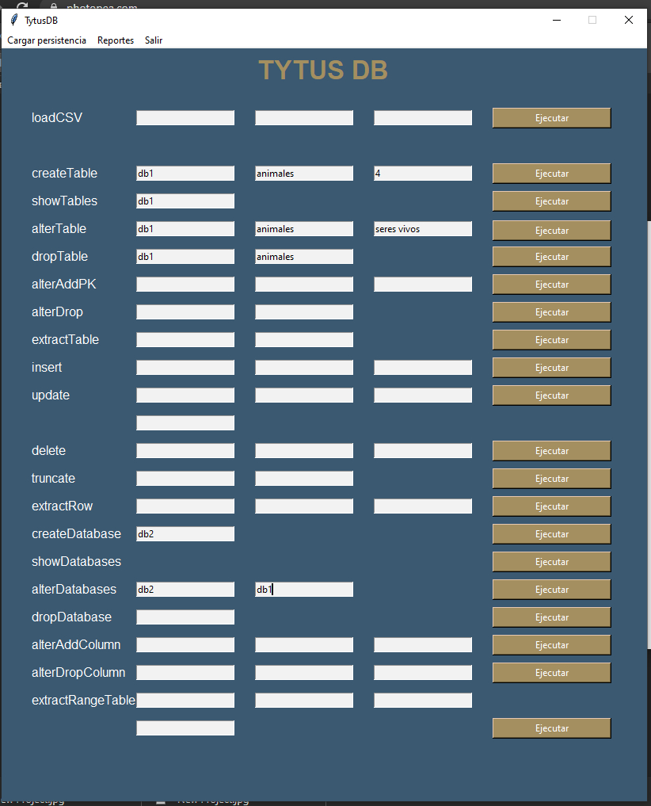
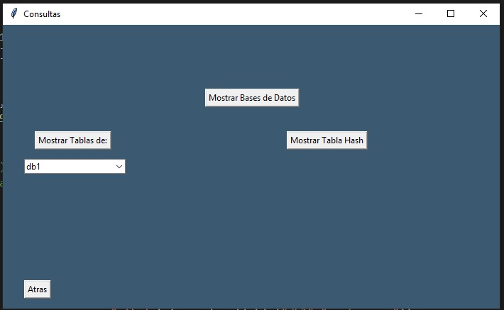
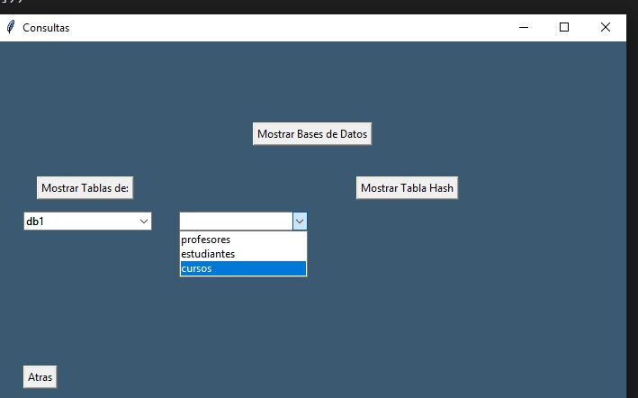
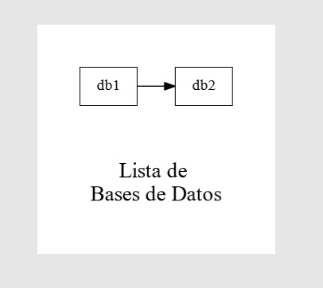
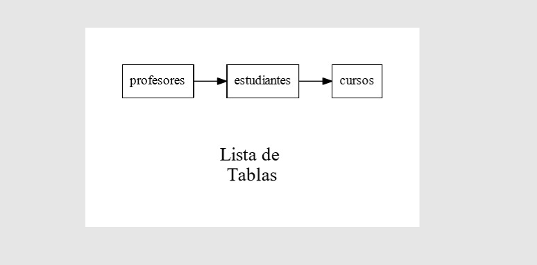
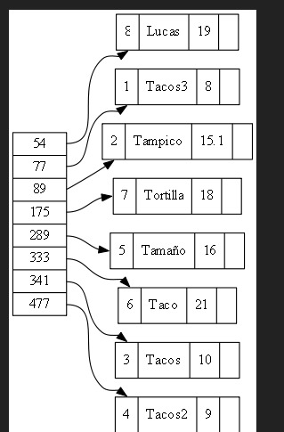
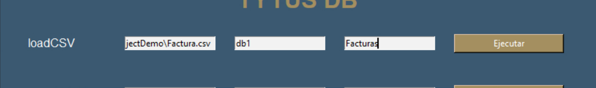

###### UNIVERSIDAD DE SAN CARLOS DE GUATEMALA
###### FACULTAD DE INGENIERÍA
###### INGENIERÍA EN CIENCIAS Y SISTEMAS
###### ESTRUCTURAS DE DATOS
###### SECCIÓN A
___
###### EQUIPO: 10
___
***

# **MANUAL DE USUARIO**
## INDICE

- Introducción
- Objetivos
- Guía Rápida
- Reportes y Pantallas
- Glosario
- Información de Contacto6

&nbsp;
# Introduccion
## DESCRIPCIÓN DE LA SOLUCIÓN CLIENTE DE TYTUSDB
El Cliente de TytusDB es un conjunto de herramientas disponibles para aquellos desarrolladores que quieran hacer uso sobre dicho sistema de almacenamiento, creado
con Python y la librería Tkinter para usos visuales, mientras por el fondo trabaja con archivos de tipo binario que ayudan a tener un almacenamiento local dentro del computador y hacer uso de una eficiente persistencia de datos. A su vez un reportador de estructuras de datos, con la librería Graphviz la cual enseña de manera gráfica como están estructurados y jerarquizados los objetos creados a lo largo del uso.

&nbsp;
# Objetivos
## General
El documento tiene la más clara intención de apoyar al usuario desarrollador, con conocimientos en almacenamiento de bases de datos, a utilizar el cliente de TytusDB tanto por medio de la carga masiva de archivos ingreso de datos digitalizados manualmente

## Específicos
- Dar a conocer el uso del formulario para realizar todas las operaciones del administrador de bases de datos, pasando únicamente los parámetros de entrada y visualizarlos en la carga reportes.
- Dar a conocer el uso de la carga masiva de datos con extensión .csv, y como visualizarlos dentro de la carga de reportes.
- Dar a conocer la persistencia de datos con archivos binarios para evitar la perdida de información.

&nbsp;
# Guía Rápida
## Ejecucion de aplicación
Se tienen 2 archivos ejecutables de tipo formularios, los cuales pertenecen a: 
- &nbsp;&nbsp;Cliente Formulario TytusDB
- &nbsp;&nbsp;Cliente De Reportes Gráficos
&nbsp;
## Ejecución de Carga Masiva
Se puede tener un archivo externo en el cual la información almacenada quiera ser cargada al sistema de almacenamiento, para esto, se tiene el soporte de archivos con extensión .csv. Un archivo CSV (valores separados por comas) es un archivo de texto que tiene un formato específico que permite guardar los datos en un formato de tabla estructurada. Gracias a esto, podemos evitar la digitalización de datos y convertir cualquier hoja .xlsx, xls, etc. En .csv para ser operado en el administrador.
[(ver más detalles)](#Carga CSV)

## Ejecución de Recuperación de Datos
Cuando se ha cargado una cantidad de datos, es guardada automáticamente en un archivo binario. Un archivo binario es un archivo informático que contiene información de cualquier tipo codificada en binario para el propósito de almacenamiento y procesamiento en ordenadores. Por lo cual se puede obtener una recuperación de la misma. [(Ver más detalles)](#Archivos Binarios)

&nbsp;
# Reportes y Pantallas
## Cliente Formulario
## Visualización de Pantalla Principal

#### Pantalla Principal, aquí pasaremos los parámetros para ejecutar cualquier función del administrador de bases de datos.

## Visualización de Pantalla de Inputs

#### Ejemplo de paso de parámetros.

## Cliente Reportes
### Visualización de Pantallas
#### Pantalla Selección
    - - 
    - - Al seleccionar mostrar Reportes nos abrira esta ventana, la cual contiene las bases de datos, junto con sus tablas y los botones respectivos para ver sus graficos.
    - - 
    - - Para obtener un grafico se debe seleccionar una base de datos y una tabla de las respectivas listas. Posteriormente se debe presionar el boton de la grafica a mostrar.    
#### Reporte Gráfico
    - - 
        Al presionar el boton "Mostrar Bases de Datos", nos mostrara el respectivo grafo de Bases de Datos con su estructura especificada en formato .SVG.(Debe poseer un software compatible para abrirlo)
    - - 
        Al presionar el boton "Mostrar Tablas", nos mostrara el respectivo grafo de Tablas con su estructura especificada en formato .SVG.(Debe poseer un software compatible para abrirlo)
    - - 
        Al presionar el boton "Mostrar Tabla Hash", nos mostrara el respectivo grafo de Tabla Hash con su estructura visualmente en formato .SVG.(Debe poseer un software compatible para abrirlo)

## Carga CSV

Como vemos, podemos cargar una ruta, en la cual vamos a abrir un archivo CSV para insertar datos en una base de datos.

## GLOSARIO
| Palabra | Definición |
| ------- | ---------- |
| CSV | Archivo de texto en el procesamiento de datos con el que se pueden registrar, almacenar y procesar grandes cantidades de datos estructurados. |
| Archivo Binario | Archivo informático que contiene información de cualquier tipo codificada en binario para el propósito de almacenamiento y procesamiento en ordenadores. |
| Base de datos | Programa capaz de almacenar gran cantidad de datos, relacionados y estructurados, que puedan ser consultados rápidamente de acuerdo con las características selectivas que se deseen. |
| SVG | Es un formato de imagen de gráficos vectoriales. |
| Parámetro | Es una variable utilizada para recibir valores de entrada en una rutina, subrutina o método. |
| Persistencia de Datos | Es la acción de perservar la información de un objeto de forma permanente, pero a su vez también se refiere a poder recuperar la información del mismo para que pueda ser nuevamente utilizado. |
| Interfaz Gráfica | Es una forma visual que permite a los usuarios interactuar con un programa de software. |
| Librería | Es un conjunto de implementaciones funcionales, codificadas en un lenguaje de progrmación, que ofrece una interfaz bien definida para la funcionalidad que se invoca. |
| Graphviz | Es una librería que permite generar grafos |
| Grafo | Representación simbólica de los elementos constituidos de un sistema o conjunto, mediante esquemas gráficos. |

## *Información de Contacto*

- [Cristian Caceres](3741681720501@ingenieria.usac.edu.gt)
- [Jimmy Larios](2993047280101@ingenieria.usac.edu.gt)
- [Sergio Castro](3016834760101@ingenieria.usac.edu.gt)
- [Daniel Velásquez](3006875750101@ingenieria.usac.edu.gt)

