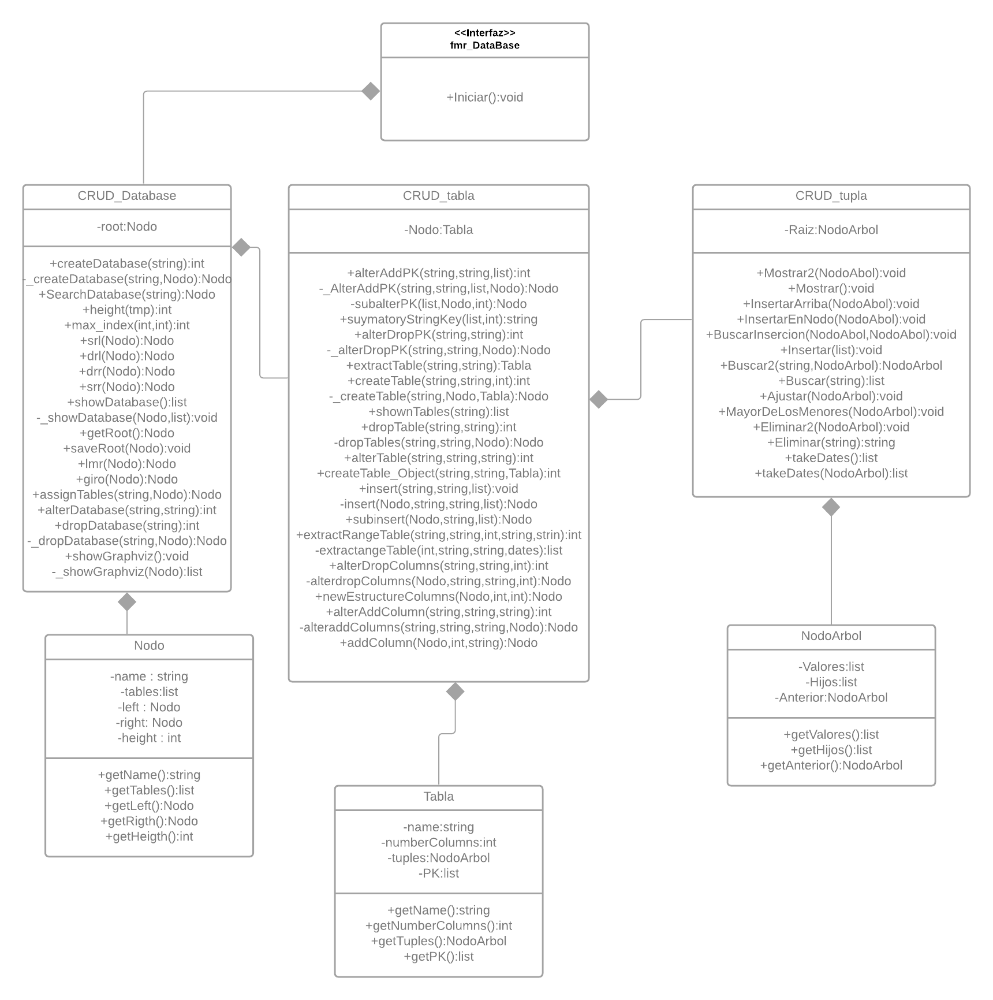
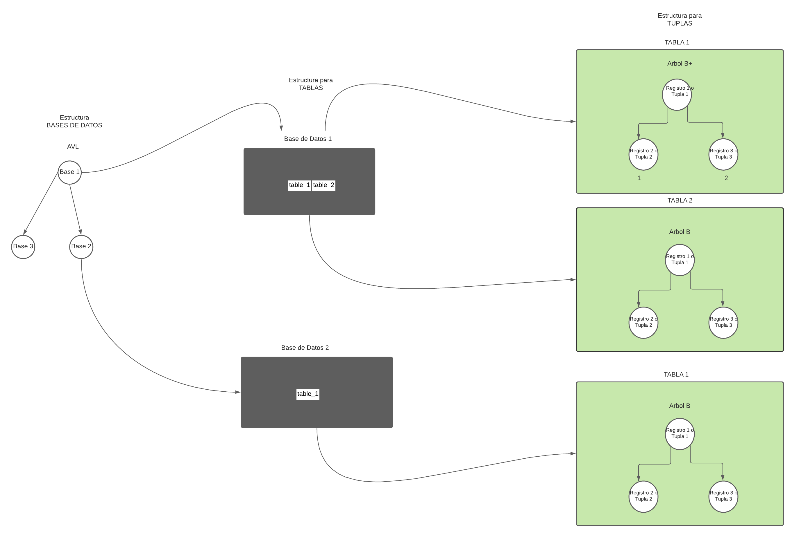
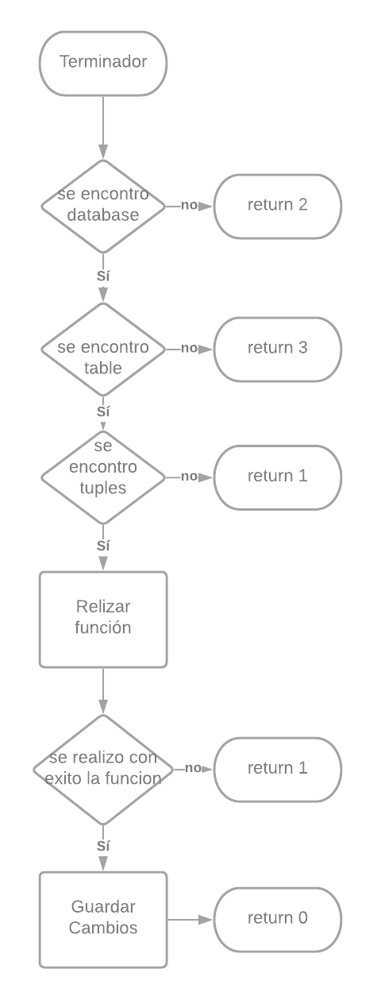

# Proyecto (FASE I)
**Descripción de solución**

**Almacenamiento**

Para el almacenamiento se utilizó una estructura arbórea compuesta por arboles avl como almacenamiento de los datos mas pequeños y para las tuplas que son normalmente donde más bifurcaciones se generan se utilizó un árbol b.

En el almacenamiento de árbol se tomo como la primera posición en ingresar seria la llave primaria de este nodo para así poder ordenarlo, el resto de las posiciones que se ingresen serán los datos, en caso del árbol b utilizamos uno de grado 3 para mayor facilidad del usuario para lectura de datos.

**Serialización**

Para el almacenamiento de los datos en la parte de memoria estática se utilizó la serialización en el nodo de bases de datos ya que este almacena toda la demás información, además con esta implementación de serialización surgió la oportunidad de decidir si hacer un commit o no en los archivos para tener mayor versatilidad a la hora de fallas, para la búsqueda de este archivo se convoca un método el cual convertirá su serie en nuestros datos anteriores en la estructura arbórea.

Requerimientos funcionales

| **Ref#** | **Función** | **Categoría** |
| --- | --- | --- |
| R1.1 | createDatabase | Evidente |
| R1.2 | showDatabase | Evidente |
| R1.3 | alterDatabase | Evidente |
| R1.4 | dropDatabase | Evidente |
| R1.5 | createTable | Evidente |
| R1.6 | showTables | Evidente |
| R1.7 | alterTable | Evidente |
| R1.8 | dropTable | Evidente |
| R1.9 | extractable | Evidente |
| R1.10 | alterAddColumn | Evidente |
| R1.11 | alterDropColum | Evidente |
| R1.12 | alterDropPK | Evidente |
| R1.13 | alterAddPK | Evidente |
| R1.14 | extractRangeTable | Evidente |
| R1.15 | Insert | Evidente |
| R1.16 | Update | Evidente |
| R1.17 | Erased | Evidente |
| R1.18 | loadCSV | Evidente |
| R1.19 | extractRow | Evidente |
| R1.20 | truncate | Evidente |

Atributos del sistema

| REF# | Atributo |
| --- | --- |
| 1 | Interfaz amigable con el usuario |
| 2 | Software modular |
| 3 | Eficiente y versátil |
| 4 | Interoperable |
| 5 | Multiplataforma |

Glosario

1. **Interoperable:** capacidad que tiene un producto o un sistema, cuyas interfaces son totalmente conocidas, para funcionar con otros productos o sistemas existentes o futuros.
2. **Software:** es el equipamiento lógico del ordenador.
3. **Árbol b:** es un árbol que se subdivide en hojas y nodos.
4. **Árbol avl:** es un árbol que solo se subdivide por nodos.
5. **Diagrama de Flujo:** muestra la estructura general de un algoritmo.
6. **Commit:** guardado de un archivo en el cual hayamos realizado un cambio

Diccionario de Clases

| **Clase** | **Definición** |
| --- | --- |
| **CRUD\_Tupla** | Contiene todos los métodos que estructuran y trasladan datos del árbol n, inicialización del nodo raíz para el árbol b |
| **CRUD\_Tabla** | Contiene todos los métodos que estructuran las tablas y también almacena CRUD\_Tupla |
| **CRUD\_DataBase** | Contiene todas las demás clases menos las frames, esta clase es la primera que se llama para poder poner en funcionamiento la estructura arbórea |
| **Nodo** | Estructura de la cual se forma el árbol avl |
| **NodoArbol** | Estructura de la cual se forma el árbol |
| **Tabla** | Estructura de la cual se forma las tablas |

Diccionario de funciones principales

Funciones de la base de datos

| **Función** | **Definición** |
| --- | --- |
| **alterDatabase** | Renombra una base de datos existente |
| **createData** | Crea una base de datos |
| **dropDatabase** | Elimina la base de datos selecciona |
| **showDatabase** | Devuelve una lista con todas las bases de datos existentes |

Funciones de las tablas

| **Función** | **Definición** |
| --- | --- |
| **createTable** | Crea una tabla en la base de datos seleccionada |
| **dropTable** | Eliminar una tabla especifica de la base de datos seleccionada |
| **showTable** | Retorna una lista con todas las listas existentes de una determinada base de datos |
| **extracTable** | Retorna una lista seleccionada de una base de datos existente |
| **ExtractRangeTable** | Retorna una lista de valor de determina columna de la tupla de una tabla |
| **alterTable** | Sustituye una tabla existente pro una nueva |
| **alterAddColumn** | Añade una columna de datos a la columna final de las tuplas contenidas por la tabla |
| **alterDropColumn** | Eliminar una columna especifica mientras no se a una llave primaria de las tuplas contenidas por la tabla |
| **alterDropPK** | Elimina las llaves primarias que tiene la tabla |
| **alterAddPK** | Añade llaves primarias a la tabla generando así una reestructuración de todo el árbol que contiene las tuplas, teniendo en cuenta como valor de ordenamiento la llave primaria indicada |

Funciones de las Tuplas

| **Función** | **Definción** |
| --- | --- |
| **Insert** | Inserta el arreglo de datos en el árbol b |
| **Update** | Acutaliza el árbol b |
| **Erased** | Borra un nodo del árbol b y luego actualiza las nueva posiciones del árbol b |
| **loadCSV** | Carga de datos por medio de archivo externo |
| **extractRow** | Extrae una columna determinada de datos del árbol b |
| **Truncate** | Vacia una tupla determinada |

Funciones de serialización

| **Función** | **Definción** |
| --- | --- |
| **commit** | Guarda los cambios hechos al archivo |
| **rollback** | Retorna los datos del archivo |

Diagrama de Clases 

  

Estructura general de Datos

  

Diagrama de flujo general de funciones

  

