# Proyecto (FASE I)

### Descripcion del Programa

TytusDB es un proyecto Open Source para desarrollar un administrador de bases de datos, el administrador encargado de gestionar el almacenamiento de las bases de datos, este administrador se divide en 3 módulos que se describirán más adelante los cuales son:
- Módulo de las Bases de Datos
- Módulo de Tablas
- Módulo de Tuplas

### Módulo de bases de datos

##### Arranque del programa

Al momento de iniciar la aplicación se le mostrara la siguiente ventana, dicha ventana le permitara interactuar con el modulo de las base de datos

  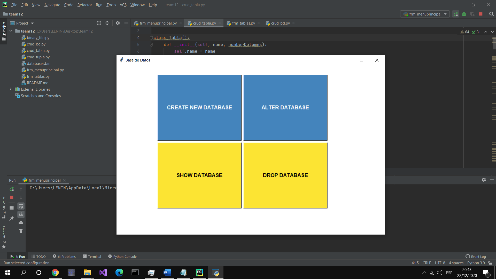

##### Creación de una Base de datos

1.	Deberá ingresar en el campo que se muestra a continuacion un nombre para su base de dato dicho nombre no debe repetirse, posterior a ello debera dar click en el botón Guardar

  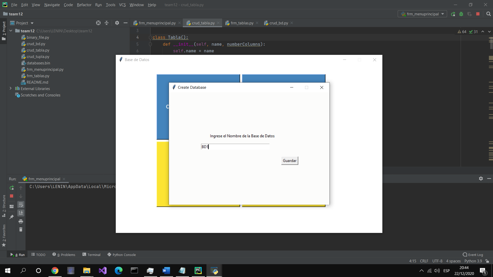

2.	Si el nombre ingresado no estaba siendo utilizado se le notificará que se agregó existosamente

  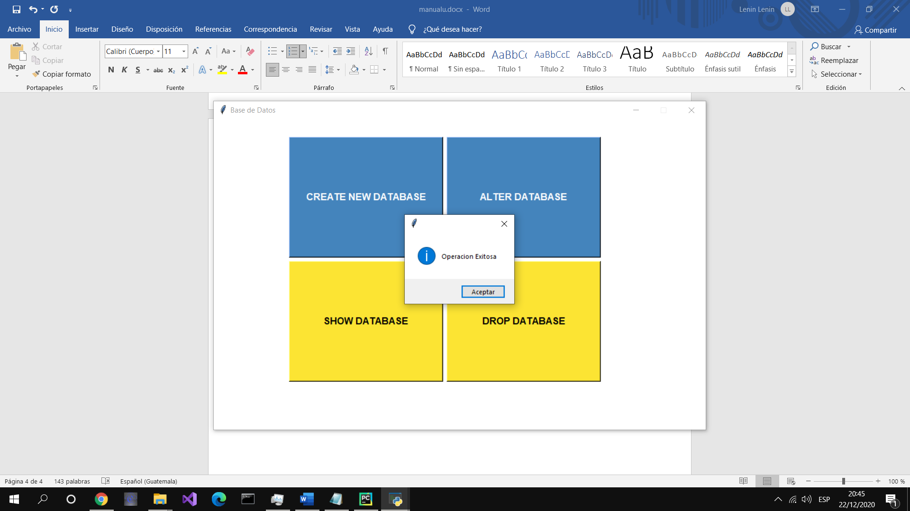

##### Ver bases de datos existentes

1.	Deberá dar click en el botón Show Database y a continuación se le mostrarán todas las bases de datos registradas

  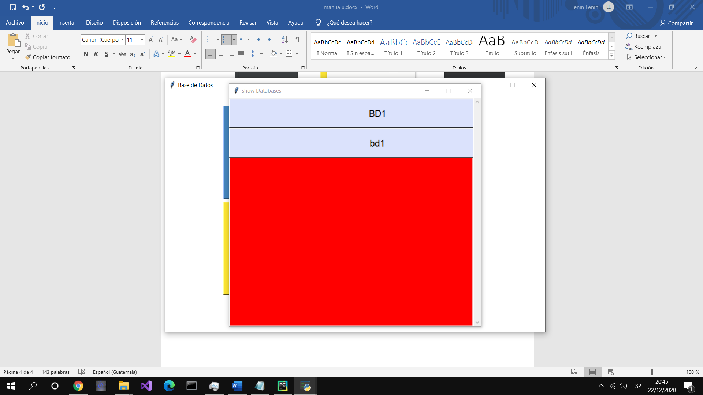

##### Editar nombre de las bases de datos

1.	Deberá dar click en el botón en Alter Database , y se le mostrará la siguiente ventana

  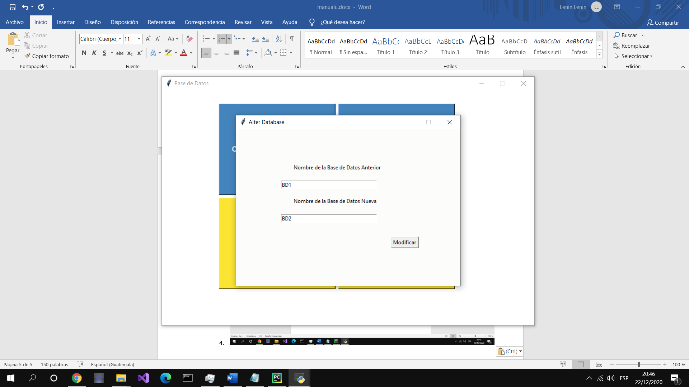

2.	Deberá ingresar en el primer campo el nombre de la base de datos a la cual desea realizar el cambio, en el segundo campo deberá ingresar el nuevo nombre que se quisiera tener

3.	Podrá dirigirse a la pestaña Show Data base para observar claramente el cambio solicitado

  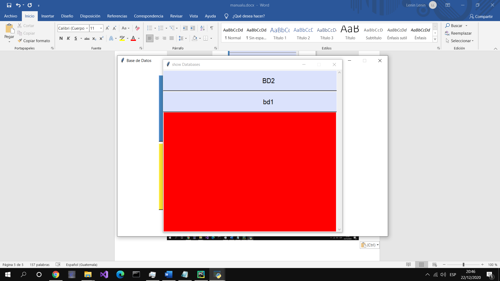

##### Eliminar un base de datos

1.	Deberá dar click en el botón en Drop database , y se le mostrará la siguiente ventana

  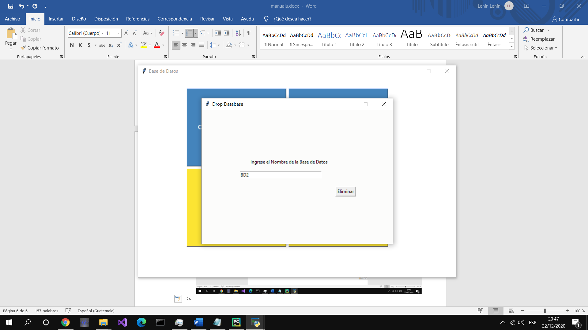

2.	Deberá ingresar en el campo el nombre de la base de datos que desea eliminar

3.	Podrá dirigirse a la pestaña Show Data base para observar claramente que se ha eliminado la base de datos

  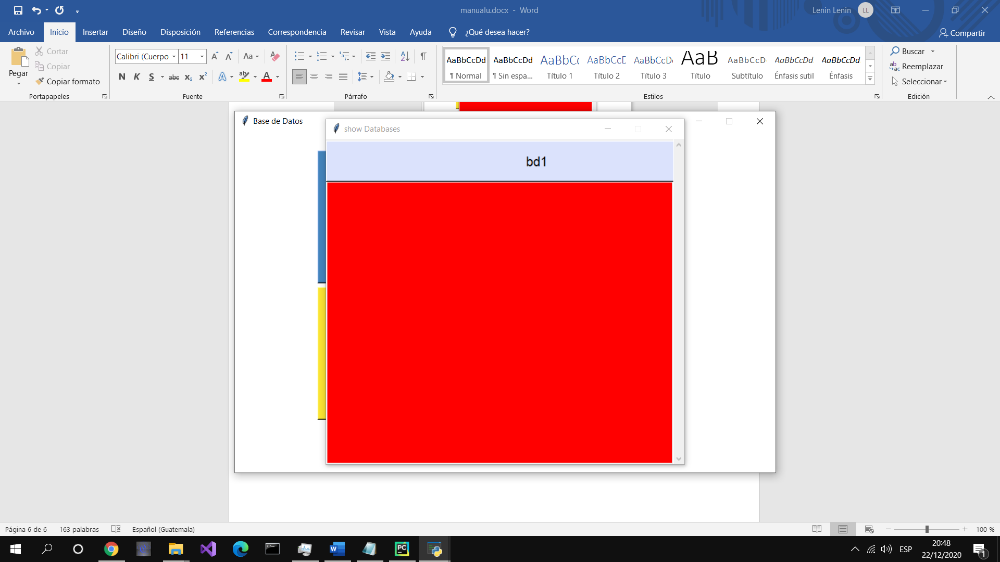

### Módulo Tablas

##### Creación de una tabla

1. Deberá ingresar en el campo que se muestra a continuacion un nombre para su tabla dicho nombre no debe repetirse, posterior a ello debera dar click en el botón Guardar

  

##### Mostrar tablas existentes

1.	Deberá dar click en el botón Show Table y a continuación se le mostrarán todas las tablas registradas

  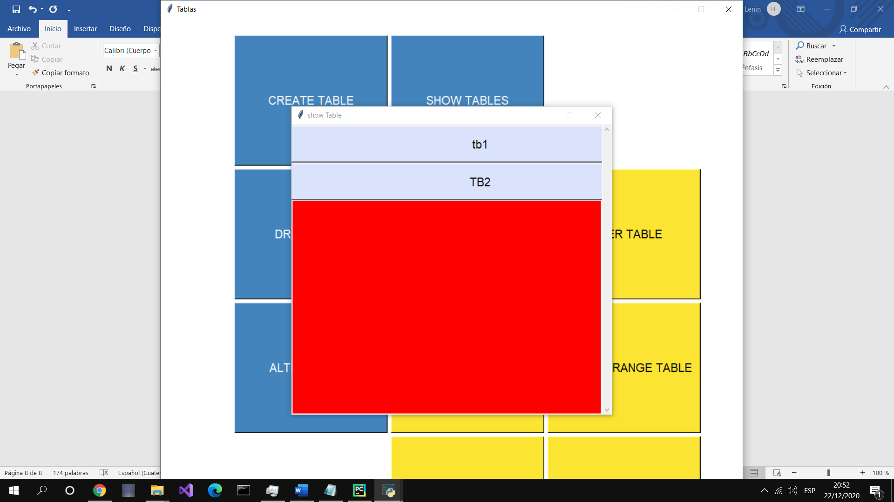

##### Editar nombre de una tabla

1. Deberá dar click en el botón en Alter Table , y se le mostrará la siguiente ventana

  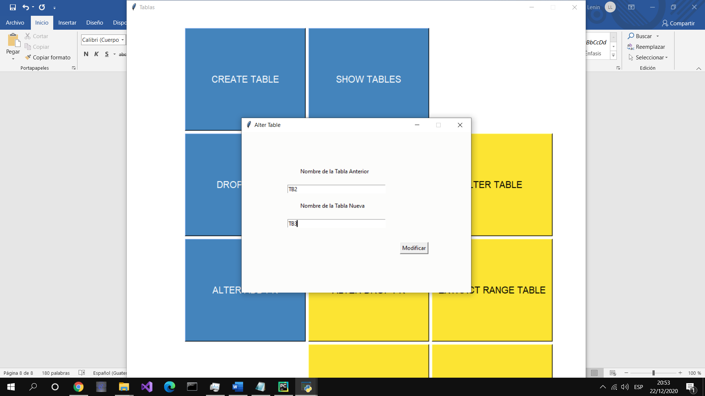

2.	Deberá ingresar en el primer campo el nombre de la tabla a la cual desea realizar el cambio, en el segundo campo deberá ingresar el nuevo nombre que se quisiera tener

3.	Podrá dirigirse a la pestaña Show Table para observar claramente el cambio solicitado

  

##### Eliminar una tabla existente

1.	Deberá dar click en el botón en Drop Table , y se le mostrará la siguiente ventana

  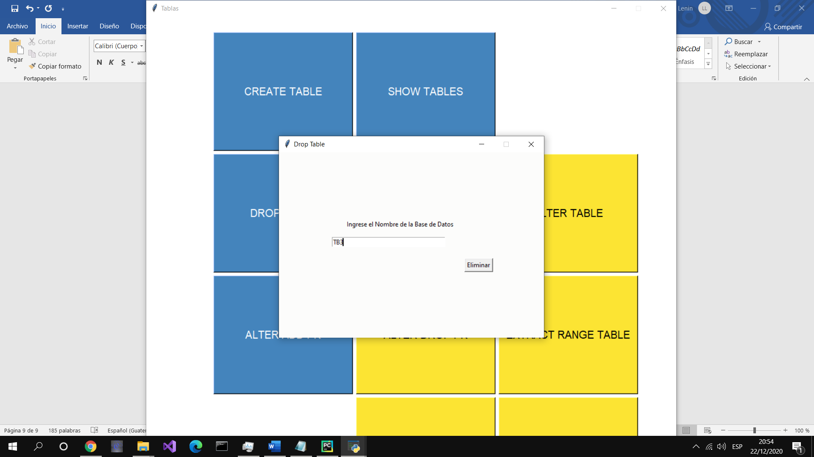

2.	Deberá ingresar en el campo el nombre de la tabla que desea eliminar

3.	Podrá dirigirse a la pestaña Show Table para observar claramente que se ha eliminado la tabla

  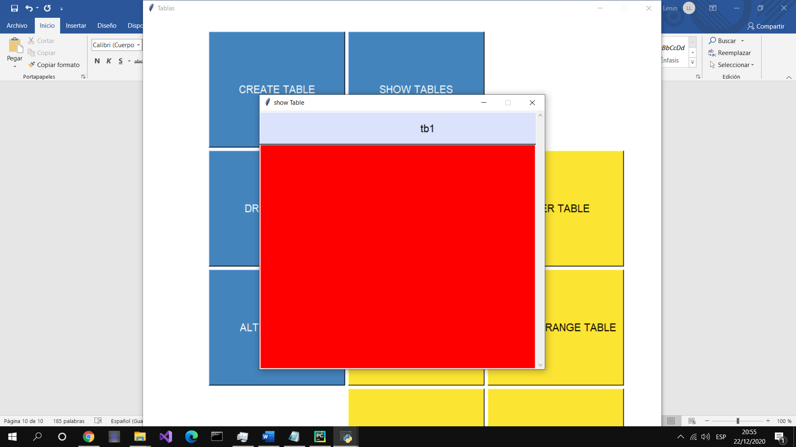

##### Agregar llave primaria

1.	Deberá dar click en el botón en Alter add pk, y se le mostrará la siguiente ventana

  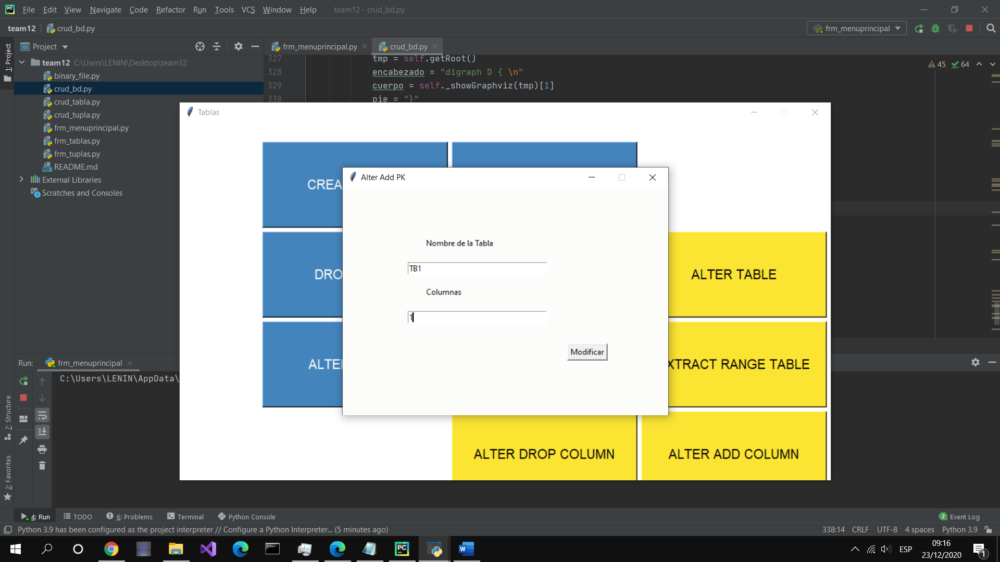

2.	En el primer campo deberá ingresar el nombre de la tabla a la cual desea agregar la pk, en el segundo campo el numero de columna que tendrá la pk

##### Alter add columna

1.	Deberá dar click en el botón en Alter add columna, y se le mostrará la siguiente ventana

  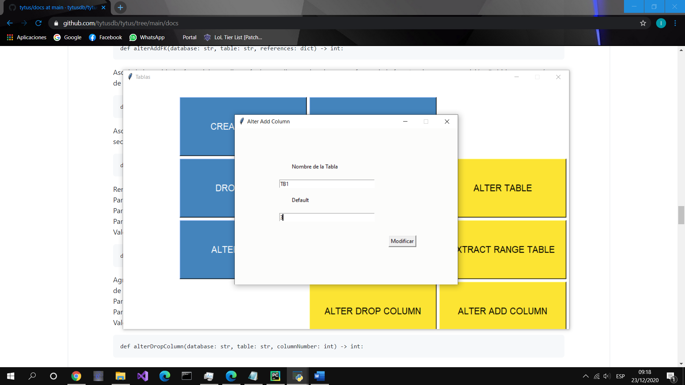

2.	En el primer campo deberá ingresar el nombre de la tabla a la cual desea agregar las columnas, en el segundo campo el número de columnas que se le agregaran a la tabla

##### Alter drop columna

1.	Deberá dar click en el botón en Alter drop columna, y se le mostrará la siguiente ventana

  

2.	En el primer campo deberá ingresar el nombre de la tabla a la cual desea eliminar la columna, en el segundo campo el número de columna que se desea eliminar

##### Eliminar pk

1.	Deberá dar click en el botón en Alter drop pk, y se le mostrará la siguiente ventana

  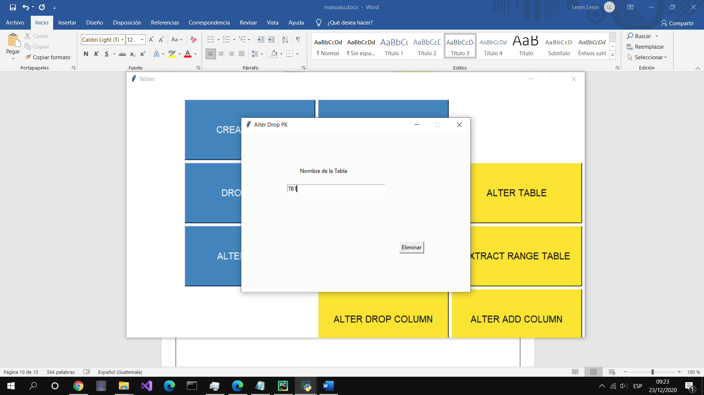

2.	En el primer campo deberá ingresar el nombre de la tabla a la cual desea eliminar la pk, en el segundo campo el número de columna tiene la pk

### Módulo Tuplas

  

##### Insert

Deberá ingresar en el campo que se muestra a continuacion.

  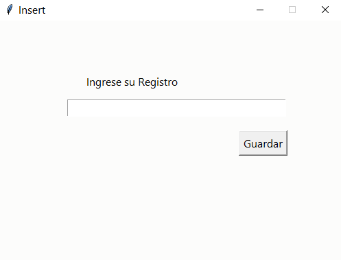

##### Load CSV

Este nos permite cargar archivos excel para cargar la base con datos

##### Extract Row
Extrae y devuelve un registro especificado por su llave primaria, es por esto que se debe de ingresar el campo que se solicita

  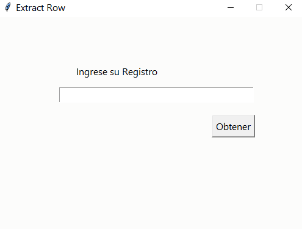

##### Update
Inserta un registro en la estructura de datos asociada a la tabla y la base de datos, para esto es que se solicita dos campos, el register y el columnas.

  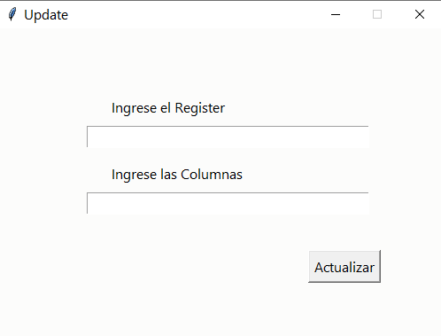

##### Delete
Elimina un registro de una tabla y base de datos especificados por la llave primaria, es por esto que se solicita la llave primaria

  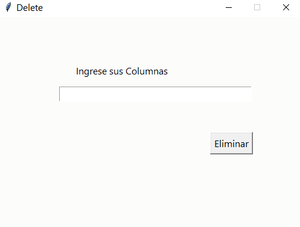

##### Truncate
Elimina todos los registros de una tabla y base de datos, solamente debe de presionarse el boton Truncate en la interfaz del frmTabla
