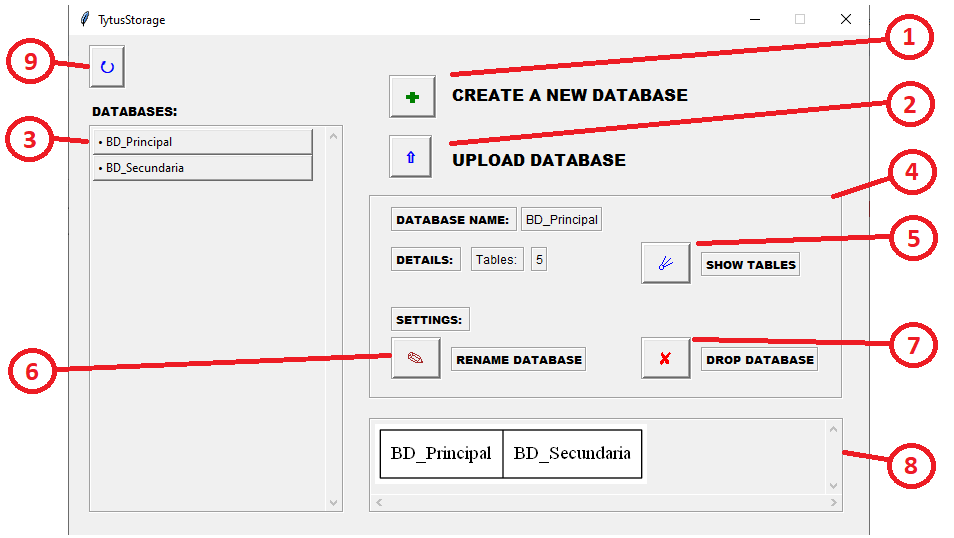

# Manual de Usuario

HashMode es una librería escrita en Python 3 que provee almacenamiento para un administrador de bases de datos (DBMS). HashMode almacena datos localmente utilizando tablas de dispersión (tablas hash).

## Indice

- [Glosario](#glosario)
- [FAQ](#faq)
- [Uso del reportador gráfico](#uso-del-reportador-gráfico)
- [Uso de la librería](#uso-de-la-librería)
- [Uso de funciones de bases de datos](#uso-de-funciones-de-bases-de-datos)
- [Uso de funciones de tablas](#uso-de-funciones-de-tablas)
- [Uso de funciones de registros](#uso-de-funciones-de-registros)


## Glosario

| TERMINO   | DESCRIPCCION   |
| ----- | ----- |
| Archivo CSV | Los archivos CSV son un tipo de documento en formato abierto sencillo para representar datos en forma de tabla, en las que las columnas se separan por comas y las filas por saltos de línea. |
| Base de datos | Una base de datos es un conjunto de datos pertenecientes a un mismo contexto y almacenados sistemáticamente para su posterior uso. Es capaz de almacenar gran cantidad de datos, relacionados y estructurados, que pueden ser consultados rápidamente de acuerdo con las características selectivas que se deseen. |
| Eficiencia | Proporcionar un desempeño apropiado, en relación con la cantidad de recurso utilizado, bajo condiciones establecidas en determinado momento del tiempo. |
| Interfaz | La interfaz es el medio donde el usuario puede comunicarse con una maquina, equipo o dispositivo, y comprender los puntos de contacto entre el usuario y el equipo.  |
| Llave Foranea | Una llave foránea o llave ajena es una limitación referencial entre dos tablas e identifica una columna o grupo de columnas en una tabla que se refiere a una columna o grupo de columnas en otra tabla. |
| Llave Primaria | Una llave primaria es un campo o una combinacion de campos que identifica de forma unica a cada fila de una tabla |
| Parametro | Un parámetro, generalmente, es cualquier característica que pueda ayudar a definir o clasificar un sistema particular. |
| Python | Python es un lenguaje de programación interpretado cuya filosofía hace hincapié en la legibilidad de su código. Se trata de un lenguaje de programación multiparadigma, ya que soporta orientación a objetos, programación imperativa y, en menor medida, programación funcional. |
| Registro | Un registro representa un objeto único de datos implícitamente estructurados en una tabla. |
| Tabla Hash | Una tabla hash es una estructura asosiada a llaves o claves con valores. La operación principal que soporta de manera eficiente es la búsqueda: permite el acceso a los elementos almacenados a partir de una clave generada. |
| Tupla | Una tupla es una lista ordenada finata de elementos (componentes).|

## FAQ

1. ¿Cuántos datos se pueden ingresar en las tablas?

> **Respuesta:** Se pueden ingresar *n* datos, dependiendo de la cantidad de columnas que posea la tabla.

2. ¿Al eliminar una base de datos, los datos registrados se pierden?

> **Respuesta:** Al eliminar la base de datos todo su contenido interno se eliminará automaticamente.

3. ¿Cuál es la diferencia entre delete row y truncate?

> **Respuesta:** El delete row sirve para eliminar la tupla seleccionada y el truncate sirve para eliminar todos los registros que posee la tabla.

4. ¿Qué tipos de registros se pueden ingresar en las tablas?

> **Respuesta:** Se pueden ingresar cadenas de texto y datos numéricos.

5. ¿Qué fallas se pueden encontrar al cargar un archivo CSV?

> **Respuesta:** El mal ingreso los datos, la estructura inadecuada, la cantidad de datos en una tupla no corresponda a una tabla con un número definido de columnas.

6. En el reportador gráfico ¿Qué representa la imagen de la estructura donde se almacenan los registros?

> **Respuesta:** Respresenta el ordenamiento de datos mediante indices, correspondiente de una tabla Hash abierta de direccionamiento cerrado.

7. ¿Qué pasa si al agregar una base de datos, una tabla, o una tupla, esta no me aparece en el listado correspondiente?

> **Respuesta:** Si en dado caso llega a suceder solo debe refresar la pagina con el boton de actualizar.

8. ¿Al finalizar el programa mis archivos se perderan?

> **Respuesta:** El programa almacenará dentro de la carpeta *data* todos sus datos.


## Uso de la librería

Para ejecutar la librería es necesario tener instalado Python 3 para [Windows](https://www.python.org/downloads/windows/) o para [Linux](https://www.python.org/downloads/source/).

HashMode se puede incorporar en un proyecto con la siguiente línea de código:

```sh
from storage import HashMode
```

Se puede acceder al repertorio de funciones posteriormente descritas de la siguiente manera:

```sh
HashMode.createDatabase("new_database")
HashMode.showDatabases()
...
```

HashMode almacena todo dentro de la carpeta *data/hash* del proyecto, de manera recurrente y eficaz. Esta ubicación puede ser cambiada mediante:

```sh
setDir("new_path")
```

## Uso del reportador gráfico

Para acceder al reporte grafico desde un main, se importa de la siguiente manera.
```sh
import ReporteGrafico as r

r.Mostrar()
```

Las siguientes son las funciones del reportador gráfico, que es capaz de manipular bases de datos, tablas y registros mediante una interfaz.

#### Ventana Base de Datos
Ventana donde se podran visualizar todas las gestiones sobre bases de datos.
1. Create a New Database: Se mostrara una ventana emergente que solicitara el nombre de la base de datos. El sistema no permitira dejar el campo en blanco o escribir el nombre de una base de datos ya exsiten. 
2. Upload databases: Se mostrara una ventana emergente que solicitara la direccion url de un archivo (csv).
3. Lista de Bases de Datos: Seccion donde se mostraran todas las bases de datos registradas o cargadas.
4. Gestiones de la base de datos: Al seleccioanr una base de datos desplegada en la lista se desplegara una caja de detalles y opciones sobre la propia base de datos.
5. Show Tables: Redirije a una nueva ventana donde se gestionaran todas la tablas que puede poseer la base de datos.
6. Rename Database: Permite cambiarle el nombre a una base de datos ya existenete. Se verificara que el nuevo nombre no sea un nombre ya existente.
7. Drop Database: Permite eliminar la base de datos seleccionada.
8. Grafico de Bases de datos: Seccion donde se muestra una imagen de las bases de datos ya registradas.
9. Update: Boton que actualiza la pagina.



#### Ventana Tablas 
Ventana donde se podran visualizar todas las gestiones sobre tablas.
1. Create a new table: Se mostrara una ventana emergente donde se solicitara el nombre y las columnas que llevara la tabla. Se solicitara que el nombre de la tabla ingresado no sea de una ya existente.
2. Update: Boton que actualiza la pagina.
3. Lista de tablas: Seccion donde se mostraran todas las tablas registradas o cargadas que almacena la base de datos.
4. Show tuples: Redirije a una nueva ventana donde se gestionaran todos los registros que puede poseer la tabla.
5. Gestiones de la tabla: Al seleccioanr una tabla desplegada en la lista se desplegara una caja de detalles y opciones sobre la propia tabla.
6. Alter column: Agrega una columna a la tabla.
7. Alter add PK: Define las llaves primarias que llevara la tabla solicitndo las columnas donde desee definirlas.
8. Alter add index: (Fase 2)
9. Extract range table: Solicita dos datos a ingresar (lower and upper) y luego la columna donde se desea posicionar los datos.
10. Rename table: Permite renombrar la tabla solicitando un nombre que no sea de una ya existente.
11. Extract table: Despliga una ventana emergente con todos los datos que posee la tabla.
12. Alter add FK: (Fase 2)
13. Alter drop PK: Elimina la llave primaria de la tabla seleccionada
14. Drop column: Solicita el numero de columna para ser eliminada.
15. Drop table: Elimina la tabla seleccionada.
16. Grafico de tablas: Seccion donde se muestra una imagen de las tablas ya registradas de una base de datos.


#### Ventana Registros
Ventana donde se podran visualizar todas las gestiones sobre los registros de las tablas.
1. Insert a new tuple: Se mostrara una ventana emergente donde se solicitara ingresar los datos separados por comas para identificar que el numero de datos corresponda al numero de columnas que posee la tabla.
```sh
Ejemplo: dato1, dato2, dato3, dato4
```
2. Update: Boton que actualiza la pagina.
3. Lista de tuplas: Seccion donde se mostraran todas las tuplas registradas en la tabla mostrando la llave primaria de referencia.
4. Extract row: Despliega una ventana emergente donde se muestran los datos de la tupla seleccionada
5. Truncate: Elimina todos los registros de la tabla.
6. Update row: Solicitara los datos primeramente del nuemero de columna seguido del dato a cambio y estos separados por una coma y para ingresar mas de un dato seprar estos por un ponto y coma.
```sh
Ejemplo: 0 , dato1 ; 1 , dato2 ; 2 , dato3 ; 3 , dato 4
```
7. Delete: Elimina la tupla seleccioanda.
8. Grafico de tuplas: Seccion donde se muestra una imagen de la estructura Hash donde se akmacenan todos los registros de la tabla.


## Uso de funciones de bases de datos

Las siguientes funciones se enfocan en la manipulación de bases de datos.

### createDatabase(database)

Crea una base de datos, dentro de la cual se pueden almacenar tablas. El parametro *database* se refiere al nombre que tendrá la base de datos. El contenido de la base de datos se almacenará dentro de *data/hash/**database***. El nombre de la base de datos debe ser un identificador SQL válido.

| Valor de retorno | Definición |
| ------ | ------ |
| 0 | Operación exitosa |
| 1 | Error en la operación |
| 2 | Nombre de la base de datos ocupado |

### showDatabases()

Despliega las bases de datos almacenadas en *data/hash*. 

| Valor de retorno | Definición |
| ------ | ------ |
| <lista> | Operación exitosa |
| <lista vacía> | No hay bases de datos almacenadas |
  
### alterDatabase(databaseOld, databaseNew)

Cambia el nombre de una base de datos almacenada. El parámetro *databaseOld* se refiere al nombre de origen, y *databaseNew* se refiere al nuevo nombre de la base de datos. El nuevo nombre de la base de datos debe ser un identificador SQL válido.

| Valor de retorno | Definición |
| ------ | ------ |
| 0 | Operación exitosa |
| 1 | Error en la operación |
| 2 | Base de datos origen inexistente |
| 3 | Nuevo nombre de la base de datos ocupado |

### dropDatabase(database)

Elimina una base de datos con todo su contenido. El parámetro *database* se refiere al nombre de la base de datos que se desea eliminar. Esta operación no puede ser deshecha.

| Valor de retorno | Definición |
| ------ | ------ |
| 0 | Operación exitosa |
| 1 | Error en la operación |
| 2 | Base de datos inexistente |

## Uso de funciones de tablas

Las siguientes funciones se enfocan en la manipulación de las tablas de una base de datos previamente definida.

### createTable(database, table, numberColumns)

Crea una tabla en la base de datos especificada. Recibe tres parámetros, los cuales son: la base de datos donde creará la tabla, el nombre de la tabla a crear y el número de columnas que tendrá la misma. No pueden existir dos tablas con el mismo nombre en la misma base de datos.

| Valor de retorno | Definición |
| ------ | ------ |
| 0 | Operación exitosa |
| 1 | Error en la operación |
| 2 | Base de datos inexistente |
| 3 | Tabla existente |

### showTables(database)
Recopila las tablas que contiene la base de datos consultada y devuelve los nombre de las tablas en una lista.

| Valor de retorno | Definición |
| ------ | ------ |
| Lista de tablas | Operación exitosa |
| <Lista vacía> | La base de datos no contiene tablas |
| None | Base de datos inexistente |

### extractTable(database, table)
Extrae los registros que contiene una tabla. Recibe dos parámetros: la base de datos seleccionada y el nombre de la tabla a la cual se extraerán sus registros. Reenvía los parametros a la sección de registros.

| Valor de retorno | Definición |
| ------ | ------ |
| Lista de Registros | Operación exitosa |
| <Lista vacía> | La tabla no contiene registros |
| None | Error en la operación |

### extractRangeTable(database, table, columnNumber, lower, upper)
Extrae los registros correspondientes a un rango solicitado, para devolverlos en una lista. Reenvía los parametros a la sección de registros.

| Valor de retorno | Definición |
| ------ | ------ |
| Lista de registros | Operación exitosa |
| <Lista vacía> | La tabla no contiene registros |
| None | Error en la operación |

### alterAddPK(database, table, columns) 
Asocia una llave primaria simple o compuesta a una tabla especificada. Reenvía los parametros a la sección de registros.

| Valor de retorno | Definición |
| ------ | ------ |
| 0 | Operación exitosa |
| 1 | Error en la operación |
| 2 | Base de datos inexistente |
| 3 | Tabla inexistente |
| 4 | Llave primaria existente |
| 5 | Columnas fuera de límites |

### alterDropPK(database, table)
Elimina la llave primaria actual en la tabla especificada. Reenvía los parámetros a la sección de registros.

| Valor de retorno | Definición |
| ------ | ------ |
| 0 | Operación exitosa |
| 1 | Error en la operación |
| 2 | Base de datos inexistente |
| 3 | Tabla inexistente |
| 4 | Llave primaria inexistente |

### alterTable(database, tableOld, tableNew)
Renombra la tabla que se especifique. Recibe 3 parámetros:  Nombre de la base de datos a acceder, el nombre actual de la tabla y el nuevo nombre que tomará.

| Valor de retorno | Definición |
| ------ | ------ |
| 0 | Operación exitosa |
| 1 | Error en la operación |
| 2 | Base de datos inexistente |
| 3 | Tabla a modificar inexistente |
| 4 | Nuevo nombre de tabla existente |

### alterAddColumn(database, table, default)
Agrega una columna más a la tabla especificada, el parámetro default es el valor que tomará la nueva columna. Reenvía los parámetros a la sección de registro.

| Valor de retorno | Definición |
| ------ | ------ |
| 0 | Operación exitosa |
| 1 | Error en la operación |
| 2 | Base de datos inexistente |
| 3 | Tabla inexistente |

### alterDropColumn(database, table, columnNumber)
Elimina la columna especificada con excepción que sean llaves primarias. Recibe 3 parámetros: Nombre de la base de datos a acceder, nombre de la tabla a modificar y numero de columna a eliminar. Reenvía los parámetros a la sección de registro.

| Valor de retorno | Definición |
| ------ | ------ |
| 0 | Operación exitosa |
| 1 | Error en la operación |
| 2 | Base de datos inexistente |
| 3 | Tabla inexistente |
| 4 | Es llave primaria o la tabla no puede quedarse sin columnas |
| 5 | Columna fuera de límites |

### dropTable(database, table)
Elimina una tabla de la base de datos especificada. Recibe dos parámetros: Nombre de la base de datos a acceder y nombre de la tabla a eliminar.

| Valor de retorno | Definición |
| ------ | ------ |
| 0 | Operación exitosa |
| 1 | Error en la operación |
| 2 | Base de datos inexistente |
| 3 | Tabla inexistente |


## Uso de funciones de tuplas

Las siguientes funciones se enfocan en la manipulación de las tuplas de una tabla previamente definida.

### insert(database, table, register)

Ingresa un nuevo registro en la tabla de la base de datos especificada. Recibe como parametro el nombre de la base de datos, de la tabla y una lista con los valores a insertar. Esta lista debe tener exactamente el numero de elementos correspondientes a el numero de columnas de la tabla especificada, si tiene columnas vacias, se sugiere que concatene None hasta completar el numero de elementos.

| Valor de retorno | Definición |
| ------ | ------ |
| 0 | Operación exitosa |
| 1 | Error en la operación |
| 2 | Base de datos inexistente |
| 3 | Tabla existente |
| 4 | Llave primaria duplicada |
| 5 | Numero de columnas no coinciden |

### extractRow(database, table, primaryKey[list])
Con esta funcion es posible extraer la informacion de una tupla especificando su llave primaria. Recibe como parametro el nombre de la base de datos, de la tabla y una lista con los valores que componen la llave primaria; si la llave primaria es simple, de igual manera se debe enviar en forma de lista; se sugiere que se envie todo dato entero en formato entero.

| Valor de retorno | Definición |
| ------ | ------ |
| Lista de datos | Operación exitosa |
| <Lista vacía> | Cualquier error en la operacion |


### update(database, table, dict, primaryKey[list])
Esta funcion permite modificar los datos de un registro en especifico, especificando su llave primaria, es posible modificar las propias llaves primarias, sin embargo se verificara que la nueva primaria no este repetida, esto para mantener la consistencia de los datos, si la nueva primaria se repite la operacion fallara. Recibe como parametro el nombre de la base de datos, de la tabla, una lista con los valores que componen la llave primaria; si la llave primaria es simple, de igual manera se debe enviar en forma de lista; y un diccionario que tenga como claves la columna a modificar y como valor el nuevo valor a modificar, se sugiere que se envie todo dato entero en formato entero.

| Valor de retorno | Definición |
| ------ | ------ |
| 0 | Operación exitosa |
| 1 | Error en la operación |
| 2 | Base de datos inexistente |
| 3 | Tabla existente |
| 4 | Llave primaria no existe |

### delete(database, table, columnNumber, primaryKey[list])
Elimina totalmente un registro de la tabla especificada por medio de su llave primaria. Recibe como parametro el nombre de la base de datos, de la tabla y una lista con los valores que componen la llave primaria; si la llave primaria es simple, de igual manera se debe enviar en forma de lista; se sugiere que se envie todo dato entero en formato entero.

| Valor de retorno | Definición |
| ------ | ------ |
| 0 | Operación exitosa |
| 1 | Error en la operación |
| 2 | Base de datos inexistente |
| 3 | Tabla existente |
| 4 | Llave primaria no existe |

### truncate(database, table) 
Vacia una tabla, dejandola sin registros pero sin eliminarla totalmente de la base de datos. Recibe como parametro el nombre de la base de datos y de la tabla a vacear.

| Valor de retorno | Definición |
| ------ | ------ |
| 0 | Operación exitosa |
| 1 | Error en la operación |
| 2 | Base de datos inexistente |
| 3 | Tabla inexistente |


### loadCSV(file, database, table)
Inserta los registros descritos en un documento *file* (.csv) en una tabla dada por el parámetro *table*, dentro de la base de datos dada por el parámetro *database*.

La función puede retornar los siguientes valores una vez.

| Valor de retorno | Definición |
| ------ | ------ |
| <Lista vacía> | Error en la operación / Base de datos inexistente / Tabla inexistente |

O también puede retornar los siguientes valores tantas veces como registros hayan en el archivo *csv*.

| Valor de retorno | Definición |
| ------ | ------ |
| 0 | Operación exitosa |
| 4 | Llave primaria duplicada |
| 5 | Base de datos inexistente |
